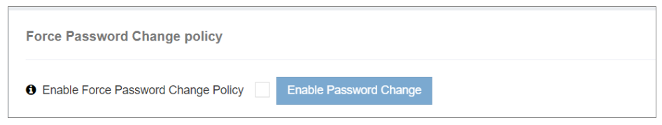

### Force Password Change

The **Force Password Change** policy in iTextPRO is an intelligent security tool designed to enforce password updates across all user accounts. This feature is especially valuable in response to suspected unauthorized access attempts on the admin account.

---

---

#### Key Functionality:

- **Enable Feature:**  
  Activating this feature triggers a proactive security response to potential unauthorized admin account access.

- **Immediate Log Out:**  
  Once enabled, iTextPRO logs out all currently active user sessions immediately, mitigating any ongoing security risks.

- **Forced Password Change:**  
  After logout, users must change their passwords upon their next login to the web interface, ensuring regular password updates and enhancing account security.

- **Purpose:**  
  This policy acts as a preventive security measure, encouraging proactive password management and helping maintain the integrity and safety of the iTextPRO platform.

---

By leveraging the **Force Password Change** feature, administrators can strengthen the security posture of their iTextPRO environment, safeguarding sensitive data and user accounts effectively.
