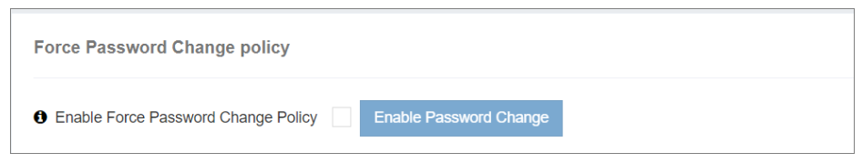

### 强制密码更改

这个 **强制密码更改** iTextPRO中的政策是一个智能的安全工具,旨在对所有用户账户执行密码更新。 这一功能对于应对行政当局账户上涉嫌未经许可进入的企图特别有价值。

---

---

#### 主要功能性 :

- **启用特性 :** 
 启用这一功能可引发对可能未经授权的管理员账户访问的主动安全反应。

- **立即注销 :** 
 一旦启用, iTextPRO 将立即删除所有当前正在运行的用户会话, 从而减少任何持续的安全风险 。

- **强制密码更改 :** 
 登录后,用户在下一次登录时必须更改密码到网络界面,确保定期更新密码并增强账户安全.

- **目的:** 
 这项政策是一项预防性安全措施,鼓励积极主动的密码管理,并帮助维护iTextPRO平台的完整性和安全性。

---

通过利用 **强制密码更改** 功能,管理员可以加强其iTextPRO环境的安全态势,有效保护敏感的数据和用户账户.
