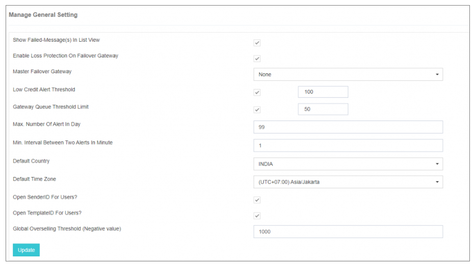

## 常規設定

單位 **常規設定**,您可以找到四個子選項:

1. 管理常規設定 
2. 強制密碼更改 
3. 強制鎖定 

---

### 管理常規設定

這個 **管理常規設定** iTextPRO中的特性賦予管理員配置各種全域性設定的能力,以加強應用程式內的功能和使用者經驗。

---

---

#### 金鑰配置選項 :

- **在列表檢視中顯示失敗的信件 :** 
 啟用時, iTextPRO 在列表檢視報告下顯示使用者賬戶中的所有失敗訊息, 顯示移動編號、 信件、 提交日期- 時間、 完成日期- 時間、 信件狀態和出錯程式碼等細節 。

- **啟用失敗通道上的丟失保護 :** 
 啟動防範因使用者賬戶銷售價格配置不當而可能發生的商業損失. 這種保護延伸到了故障通道。

- **Fallover 主關 :** 
 定義一個全域性性失效閘道器。 如果主閘道器面臨斷路,所有連線的簡訊流量都會被接通到失效閘道器.

- **低信用提醒通知 :** 
 為低信用電子郵件提示設定全球閾值 。 使用者在賬戶餘額超過這一閾值時會收到通知,從而引起回充.

- **閘道器佇列閾限 :** 
 配置閘道器佇列中信件的閾值。 到達後, 向管理員傳送電子郵件提醒, 並附上閘道器和佇列信件的細節 。

- **一天中提醒的最大次數 :** 
 限制每天的電子郵件提醒次數,以防止垃圾郵件,並在斷電或類似事件中管理頻繁的通知.

- **兩個警告之間的最小間隔:** 
 定義連續電子郵件提醒之間的最小時間間隔(分分鐘)來避免通知過多.

- **預設國家和時區 :** 
 設定在使用者註冊和"新增新使用者"選項時顯示的預設國家和時區值,允許使用者選擇自己的偏好,並確保正確的日期/時間顯示.

- **開啟使用者的發件人ID和模板 :** 
 在建立新使用者時預設啟用這些選項 。

- **全球超銷門檻 :** 
 在管理賬戶中預設可適用於使用者賬戶的透支限制.

---

這些設定共同促進了iTextPRO內部的定製化、效率和控制,確保管理人員和使用者都有定製和無縫的經驗。
