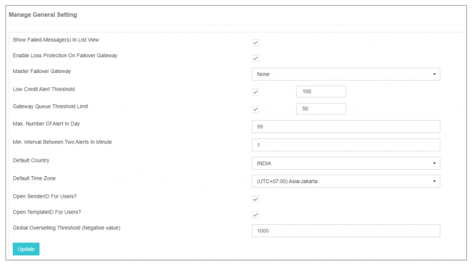

## ⚙️ General Settings

In **General Settings**, you can find four sub-options:

1. Manage General Settings  
2. Force Password Change  
3. Force Lock Down  

---

### Manage General Settings

The **Manage General Settings** feature in iTextPRO empowers administrators to configure various global settings to enhance functionality and user experience within the application.

---

---

#### Key Configuration Options:

- **Show Failed Messages in List View:**  
  When enabled, iTextPRO displays all failed messages in users' accounts under the list view report, showing details like Mobile Number, Message, Submit Date-Time, Done Date-Time, Message Status, and Error Code.

- **Enable Loss Protection on Failover Gateway:**  
  Activates protection against potential business loss due to misconfigurations in user account selling price. This protection extends to the failover gateway.

- **Master Failover Gateway:**  
  Defines a global failover gateway. If the primary gateway faces an outage, SMS traffic for all connectivity is routed to the failover gateway.

- **Low Credit Alert Notification:**  
  Sets a global threshold for low credit email alerts. Users receive notifications when their account balance crosses this threshold, prompting recharge.

- **Gateway Queue Threshold Limit:**  
  Configures a threshold for messages in the gateway queue. When reached, an email alert is sent to the admin with details of the gateway and queued messages.

- **Maximum Number of Alerts in a Day:**  
  Limits the number of email alerts per day to prevent spam and manage frequent notifications during outages or similar events.

- **Minimum Interval Between Two Alerts:**  
  Defines the minimum time interval (in minutes) between successive email alerts to avoid excessive notifications.

- **Default Country and Time Zone:**  
  Sets default country and time zone values displayed during user signup and "Add new user" options, allowing users to select their preferences and ensuring correct date/time display.

- **Open Sender ID and Templates for Users:**  
  Enables these options by default when creating new users.

- **Global Over-Selling Threshold:**  
  Pre-configured overdraft limit in the admin account that can be applied to user accounts.

---

These settings collectively contribute to customization, efficiency, and control within iTextPRO, ensuring a tailored and seamless experience for administrators and users alike.
