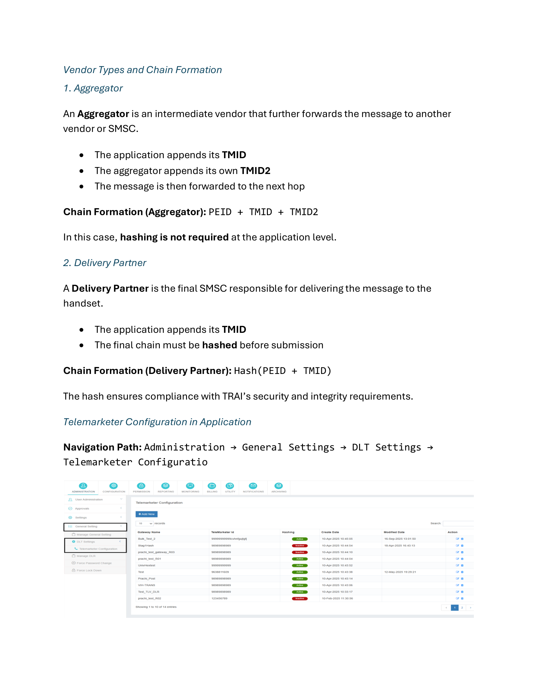
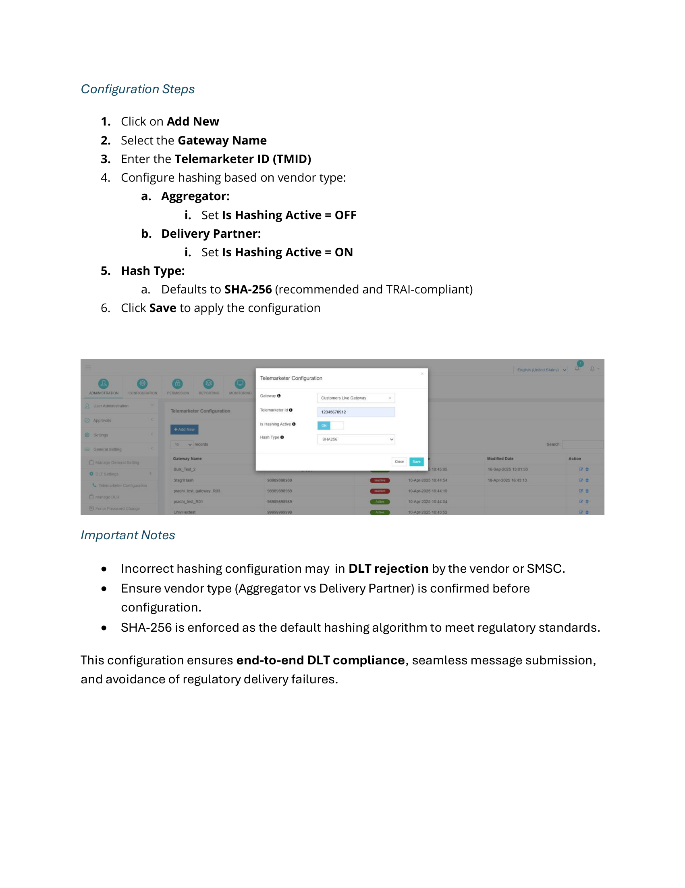

# Telemarketer Configuration

With the introduction of **TRAI DLT regulations**, SMS traffic in India must follow a mandatory **PE-TM Chain** (Principal Entity-Telemarketer chain). This chain ensures traceability and regulatory compliance across all stakeholders involved in message delivery, including the **User, Reseller, Application, and Vendor**.

To comply with these regulations, the application must be configured to **append the required Telemarketer information** before submitting messages to the upstream vendor or SMSC.

---

## PE-TM Chain Formation Logic

The PE-TM chain is constructed dynamically during message submission based on the **vendor type**.

### Message Flow

1. The **user** submits the message along with their **Principal Entity ID (PEID)**.
2. The **application** appends its configured **Telemarketer ID (TMID)**.
3. The final structure of the chain depends on the vendor type.

---

## Vendor Types and Chain Formation

=== "Aggregator"

    An **Aggregator** is an intermediate vendor that further forwards the message to another vendor or SMSC.

    - The application appends its **TMID**
    - The aggregator appends its own **TMID2**
    - The message is then forwarded to the next hop

    **Chain Formation:** `PEID + TMID + TMID2`

    !!! info
        Hashing is **not required** at the application level for Aggregator vendors.

=== "Delivery Partner"

    A **Delivery Partner** is the final SMSC responsible for delivering the message to the handset.

    - The application appends its **TMID**
    - The final chain must be **hashed** before submission

    **Chain Formation:** `Hash(PEID + TMID)`

    !!! info
        The hash ensures compliance with TRAI's security and integrity requirements.

---

## Telemarketer Configuration in Application

**Navigation Path:** `Administration → General Settings → DLT Settings → Telemarketer Configuration`

---

## Configuration Steps

1. Click on **Add New**
2. Select the **Gateway Name**
3. Enter the **Telemarketer ID (TMID)**
4. Configure hashing based on vendor type:
    - **Aggregator:** Set **Is Hashing Active = OFF**
    - **Delivery Partner:** Set **Is Hashing Active = ON**
5. **Hash Type:**
    - Defaults to **SHA-256** (recommended and TRAI-compliant)
6. Click **Save** to apply the configuration

---

!!! danger "Important Notes"
    - Incorrect hashing configuration may result in **DLT rejection** by the vendor or SMSC.
    - Ensure vendor type (Aggregator vs Delivery Partner) is confirmed before configuration.
    - SHA-256 is enforced as the default hashing algorithm to meet regulatory standards.
