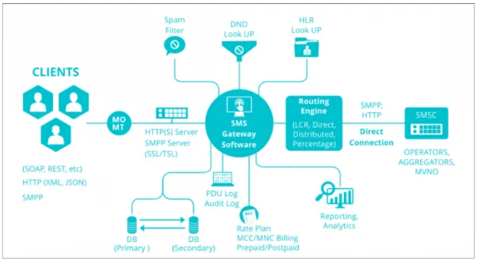
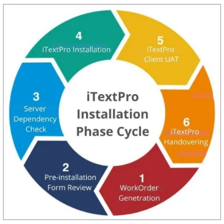

# Introduction

**iTextPro** is your gateway to seamless, **enterprise-grade mobile messaging**. This powerful software enables you to set up a **hosted SMPP server** and **messaging application**, offering an array of benefits to enhance your communication capabilities.

## 🔑 Key Features

### **🚀 High Throughput**

Experience unmatched throughput with **iTextPro**. Our solution is designed to deliver **high scalability**, ensuring **exceptional performance** for your two-way hosted messaging server. When it comes to throughput, **iTextPro is a game-changer**.

### **🔌 Compatibility**

**iTextPro** comes equipped with a **comprehensive suite of recommended plugins**. Easily integrate our core engine with any **Kannel SMPP-based application**, guaranteeing **seamless compatibility** and **hassle-free operation**.

### **🎁 Packed With Goodies**

**iTextPro** is brimming with valuable plugins designed to empower your business:

- **2-Way messaging** – *MO (Shortcode/Long code)*
- **HTTP Gateway**
- **Smart SMS**
- **Email to SMS**
- **Archiving**
- **Invoicing**
- **Bucket System**
- **HLR Lookup**

These features are your ticket to **diversifying your business verticals** and **driving growth**.

### **⚖️ Load Balancing**

Manage larger campaigns efficiently with **iTextPro**. Our software suite allows you to connect an **unlimited number of telecom/aggregator gateways**, enabling **load balancing** to process substantial campaigns in a short period.

> **Note:**  
> "**iTextPro**" is the **product name**, and "**PowerSMPP**" is the **brand name**. In this document, we exclusively use **iTextPro** to refer to our exceptional mobile messaging software.

With **iTextPro**, you gain the ability to harness the full potential of mobile messaging for your enterprise. Discover the **convenience**, **compatibility**, and **power** of **iTextPro** today.

---

# iTextPRO: Your Comprehensive Integrated Platform for SMSC Development

**Empowering Entrepreneurs and Enterprises for Seamless Two-Way Communication**

## 🧭 Introduction

**iTextPRO** is a meticulously crafted **integrated platform**, purpose-built to cater to the specific requirements of **enterprising entrepreneurs** and **established enterprises**. This robust platform is designed to facilitate the development of your own **Short Message Service Center (SMSC)** while adeptly managing **two-way communication**, encompassing both **Mobile Terminated (MT)** and **Mobile Originated (MO)** messages.

### 🔑 Key Distinctive Feature

#### **⚙️ Streamlined Configuration**

The foremost advantage of **iTextPRO** lies in its **unerring simplicity**. It dispenses with the confusion and complexity often associated with the use of an array of intricate configuration files.

Instead, our **comprehensive yet elegantly straightforward** approach sets **iTextPRO apart** as a **unique and user-friendly** application.

> Discover the power of **simplicity**, as **iTextPRO** empowers your business with the capability to establish a **highly effective SMSC**, devoid of the typical intricacies. Our **holistic approach** ensures a **unique and straightforward user experience**, allowing you to focus on **seamless two-way communication** and the continued growth of your entrepreneurial or enterprise endeavors.

---

# An Intuitive Solution for All, with Scalability in Mind

## 🖥️ User-Friendly Interface

**iTextPRO** has been meticulously designed to cater to users and administrators from all backgrounds, even those **without technical expertise**. The platform's **clean and intuitive user interface** ensures a **hassle-free experience**, making it exceptionally **easy to navigate and manage**.

## 🧱 Robust Messaging Architecture

Our **messaging architecture** is built to **scale effortlessly**, capable of handling a broad spectrum of transaction volumes. It seamlessly accommodates workloads ranging from:

- **10,000 transactions per second** to  
- **more than 25,000 transactions per second**.

This ensures your messaging needs are met, regardless of the scale of your operations — all while maintaining the **user-friendly experience** that sets **iTextPRO** apart.

## ⚡ Efficient Setup

Our installation process is designed to be **swift and efficient**. Typically, within **2–3 working hours**, we handle the **entire installation, configuration, testing**, and **fine-tuning** of your **iTextPRO** application.

> Gain insight into the step-by-step **iTextPRO Installation Phase Cycle** below for a comprehensive overview of the process.

---

# Preparing for Live Testing

To facilitate **live testing** on our server, you are required to share your **SMPP bind credentials** for **SMS MO (Mobile Originated)** and **MT (Mobile Terminated)** connections. These credentials are typically obtained from your:

- **SMS Gateway Vendor** or  
- **SMSC (Short Message Service Centre)**

This entity plays a **vital role** in storing, forwarding, converting, and delivering SMS messages to mobile handsets — typically represented by a **telecom company** or a **third-party aggregator**.

---

## 📦 Sample SMPP Connection Parameters

Your typical **Telco or SMSC** will provide you with the following essential parameters:

- **SMSC IP Address** *(Mandatory)*
- **SMSC Port** *(Mandatory)*
- **System ID** *(Mandatory)*
- **Password** *(Mandatory)*
- **System Type**
- **Bind Mode**: *Transmitter / Receiver / Transceiver* *(Mandatory)*
- **Number of Sessions**: *Tx / Rx / TxRx* *(Mandatory)*
- **TON (Type of Number)**
- **NPI (Numbering Plan Indicator)**

> ⚠️ **Important Note:**  
> Many **SMSC providers require whitelisting** of your Server's IP address for successful integration. It is **advisable to raise a support ticket in advance** to initiate the whitelisting process for the newly procured IP address of your server.

---

Our commitment is to ensure a **smooth and successful live testing experience**, and sharing these details will help us make that a reality.
