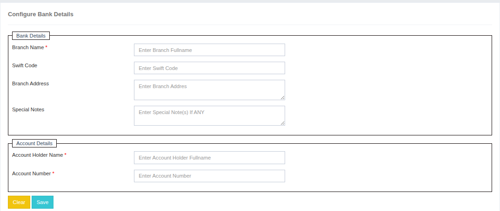

### Configure Bank Details

The **Configure Bank Details** section allows you to store and manage the bank account information where payments from clients should be made.  
You can enter complete bank details to ensure smooth payment processing.

The following details need to be provided:

1. **Branch Name** – Enter the name of the bank branch.
2. **Swift Code** – Provide the SWIFT/BIC code for international transactions.
3. **Address** – Add the full address of the bank branch.
4. **Special Note** – Include any additional instructions or notes related to the payment process.

