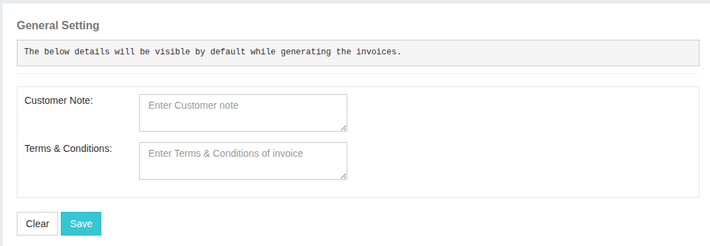

## Configurations

### General Settings

The **General Settings** section allows you to configure and customize the default information that appears on all generated invoices.  
From this panel, you can update:

- **Customer Note** – A customizable note that will appear on the invoice for your users.
- **Terms and Conditions** – The terms that will be included at the bottom of every invoice.

These settings help maintain consistency across all invoices sent to your clients.

