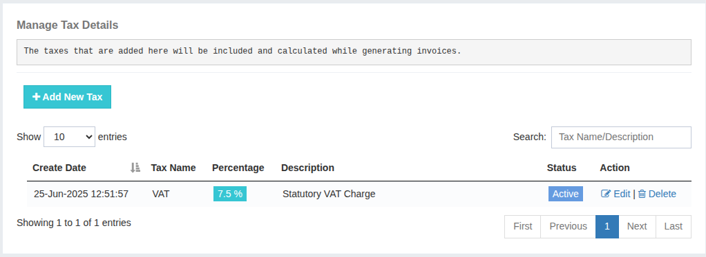

### Manage Tax Details

The **Manage Tax Details** section allows you to configure the taxes applicable to your business and apply them automatically to your users’ invoices.  
To add a new tax, click on **Add New Tax** and fill in the following details:

1. **Tax Name** – A user-friendly name for the tax.
2. **Tax Percentage** – The percentage rate of the tax that needs to be applied.
3. **Description** – A brief explanation or details regarding the tax.
4. **Tax Applicable** – Enable this option to ensure the tax is applied on all invoices.

