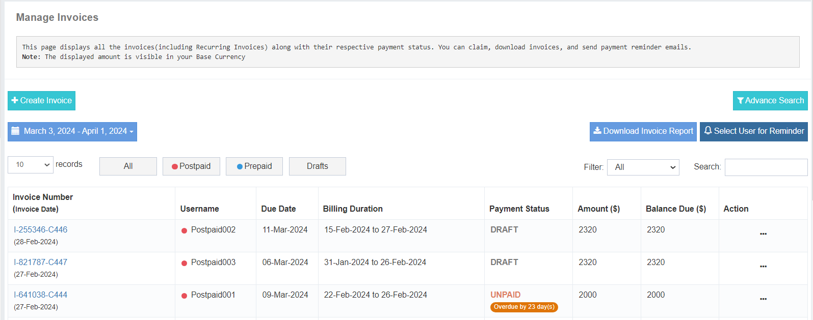

# Invoicing

The Invoicing module allows Admins to manage billing for their direct users (Account type: **User**) by providing a plugin to generate invoices, download them, or send them via email. The invoice generation flow is automated and triggered at specific intervals configured by the Admin.

This module helps Admins manage the billing operation of their child users efficiently.

---

## Invoice [Prepaid / Postpaid] as Plugin

The Admin must opt for an **Invoicing License** separately. Once enabled, the invoicing module becomes accessible in the application with the selected billing mode—**Prepaid** or **Postpaid**.

- The **Billing Method** (Prepaid/Postpaid) for each user is defined during user creation.
- Admin can configure the invoicing method for each user.
- Users who sign up on their own will have **Prepaid** billing by default.

---

## Invoicing Dashboard

When the Admin accesses the invoicing module, the first view presented is the **Invoicing Dashboard**. The dashboard provides key billing insights:

### 1. Total Invoice
Shows the **total number of invoices**, including:
- Approved invoices  
- Not approved invoices  

### 2. Paid Invoices
Displays the count of **fully paid invoices**.

### 3. Unsettled Invoices
Shows the number of invoices that are still pending, with:
- Unpaid invoices  
- Partially paid invoices  

### 4. Manage Invoice
A brief summary of the *Manage Invoice* section.  
Admins can click **Go to Page** to navigate to detailed invoice management.

### 5. Manage Recurring Invoices
Applicable **only for Postpaid users**.  
From here, Admins can:
- Create recurring invoices  
- Start or stop the billing cycle  
- Modify billing cycle settings  

### 6. Manage Payment Received
A brief summary of the *Manage Payment Received* section.  
Admins can redirect to the detailed page using the **Go to Page** button.

---

## Manage Invoices

The **Manage Invoices** page displays all invoices (including recurring invoices) along with their payment status. Admins can claim invoices, download them, and send payment reminder emails.

### Key Features:

#### **Download Invoice Report**
Allows Admins to export and download the invoice report as an Excel sheet.

#### **Send Bulk Reminder**
Enables sending payment reminders to users whose invoices are **Unpaid** or **Partially Paid**.

#### **Drafts**
Recurring invoices auto-generated for Postpaid users are stored as **drafts**.  
Admins must review and approve the drafts manually from the Action menu.

#### **Advance Search**
The advanced search option allows filtering invoices by:
- User  
- Invoice ID  
- Due status  
- Payment status  

This helps Admins locate invoices quickly based on specific requirements.

---

## Create Invoice

This section allows Admins to manually create invoices for users.

---

### **For Prepaid Users:**

1. Select the user type: **Prepaid**
2. Choose the user.
3. Enter the **Invoice Date** and **Due Date**.
4. Enter the **Recharge Amount** (before taxes).
5. Provide a **description** for the invoice.
6. Modify **Terms & Conditions** or **Customer Notes** if needed (or use default configured values).
7. Choose one of:
   - **Create Invoice** (if payment is not yet received)
   - **Create & Claim Invoice** (if payment has already been received — the system will prompt to enter payment details)

---

### **For Postpaid Users:**

Postpaid invoices are usually auto-generated at the end of the billing cycle defined under **Recurring Invoices**.  
However, if a cycle was skipped or needs manual intervention, Admins can create the invoice manually:

1. Select the user type: **Postpaid**
2. Choose the user.
3. Select the **date range** for which the invoice should be created and fetch the records.
4. The system will display the messaging records for the selected period.
5. After verification, choose:
   - **Create Invoice**
   - **Create and Claim Invoice**

