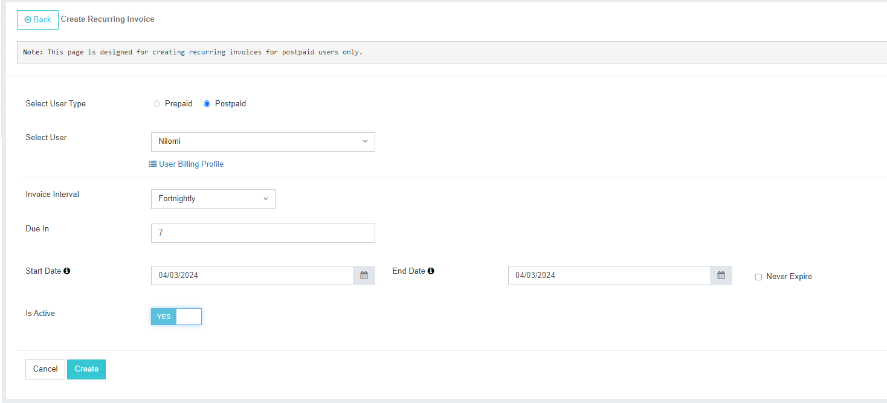

## Recurring Invoice

This page allows you to **add, view, and edit** the invoice cycles for your **Postpaid Users**.  
The dashboard displays all the active invoice cycles along with their details.  
You can **start or stop** any invoice cycle using the Action menu.

### 1. Create Recurring Invoice
This option is used to create a new recurring invoice cycle for your Postpaid user.  
Follow the steps below to create a cycle:

1. **Select the user.**
2. **Select the invoice interval** – Weekly, Fortnightly, Monthly, or Quarterly.
3. **Due in:**  
   Defines the number of days after invoice creation when the invoice will be considered overdue.
4. **Start Date & End Date:**  
   These dates define the validity period of the invoice cycle.  
   - If you enable **"Never Expire"**, invoices will continue to generate indefinitely.
5. **Is Active:**  
   Enable this option to start the invoice cycle for the selected user.

### Screenshot

