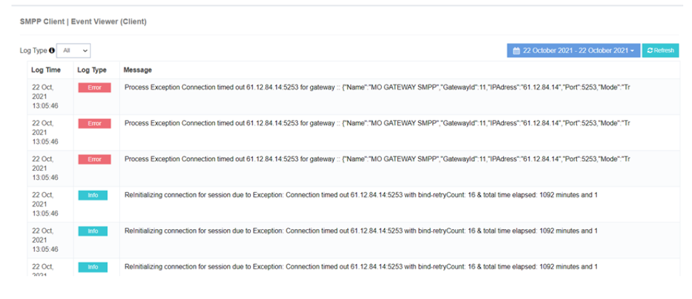

# Event Viewer (Client)

The **iTextPRO Event Viewer (Client)** monitors and logs **system events**, providing administrators with a detailed view of **errors and crashes** that may impact SMS traffic.  
This tool is essential for **proactive issue resolution** and **efficient troubleshooting**, helping maintain system stability.

---

## Key Features
- **Event Monitoring** – Tracks all relevant iTextPRO system events.
- **Detailed Error Logs** – Displays complete error and crash details for diagnosis.
- **Proactive Troubleshooting** – Enables early detection and resolution of issues.
- **Admin Time Zone** – All logs are visible according to the admin’s time zone.

---

## Benefits
- **Proactive Issue Resolution** – Identify and resolve problems before they escalate.
- **Enhanced Troubleshooting** – Detailed logs enable faster root cause analysis.
- **Maintains System Stability** – Ensures uninterrupted SMS platform performance.

---

> **Note:** Regularly checking the **Event Viewer** is crucial for staying informed about system health and ensuring **optimal SMS platform performance**.
