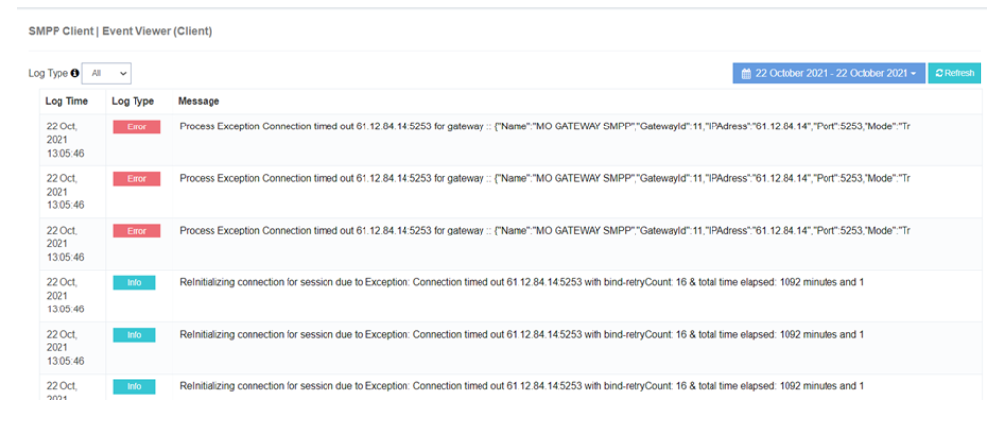

# Visualizador de eventos (cliente)

A **Visualizador de eventos iTextPRO (Cliente)** monitores e logs **eventos do sistema**, fornecendo aos administradores uma visão detalhada do **erros e falhas** que possam ter impacto no tráfego de SMS. 
Esta ferramenta é essencial para **resolução proactiva de problemas** e **resolução de problemas eficiente**, ajudando a manter a estabilidade do sistema.

---

## Características Principais
- **Monitorização de eventos** – Acompanha todos os eventos relevantes do sistema iTextPRO.
- **Registos de Erros Detalhados** – Exibe erros completos e detalhes de falha para o diagnóstico.
- **Resolução de Problemas Proativos** – Permite a detecção precoce e resolução de problemas.
- **Zona horária da administração** – Todos os registros são visíveis de acordo com o fuso horário do administrador.

---

## Benefícios
- **Resolução de Problemas Proativos** – Identificar e resolver problemas antes que eles se intensificam.
- **Solução de Problemas Melhorada** – Registros detalhados permitem uma análise mais rápida da causa raiz.
- **Mantém a estabilidade do sistema** – Garante o desempenho ininterrupto da plataforma SMS.

---

!!! tip
 Verificação regular do **Visualizador de eventos** é crucial para se manter informado sobre a saúde do sistema e garantir **Desempenho ideal da plataforma SMS**.
