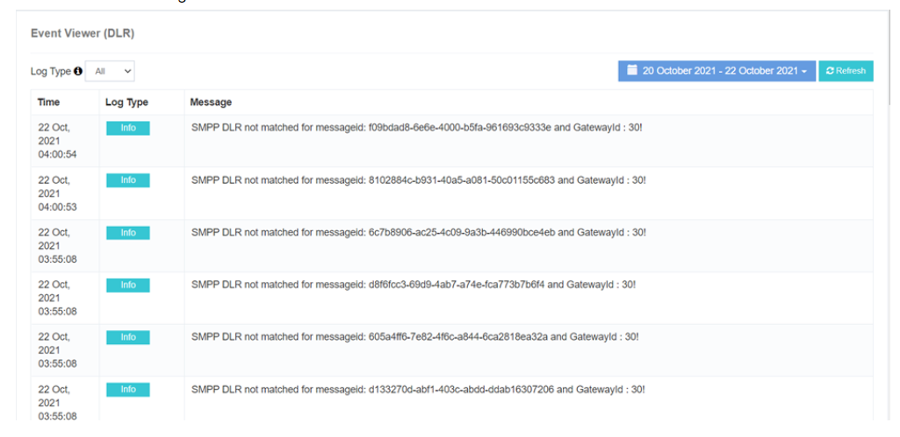

# Event Viewer (DLR)

El **iTextPRO Event Viewer (DLR)** proporciona información valiosa sobre **errores encontrados durante el informe de entrega (DLR) actualizaciones**. 
Se captura **Detalles completos del evento**, permitiendo una solución eficiente de problemas y asegurar el procesamiento DLR sin costuras.

---

## Características clave
- **DLR Event Monitoring** – Rastrea todos los eventos de actualización DLR en el sistema.
- **Captura de error detallado** – Registros precisa información de error para el análisis.
- **Apoyo a la solución de problemas** – Facilita la resolución rápida y precisa de problemas.
- **Zona horaria de Admin** – Todos los registros se muestran según la zona horaria del administrador.

---

## Beneficios
- **Identificación del número de error** – Detectar y abordar rápidamente problemas relacionados con DLR.
- **Solución de problemas** – Acelera el proceso de resolución.
- **Funcionalidad DLR robada** – Mantiene precisión y fiabilidad de los informes de entrega.

---

!!! tip
 Revisión periódica de **Event Viewer (DLR)** es esencial para mantener la fiabilidad de actualización de DLR y abordar rápidamente cualquier problema.
