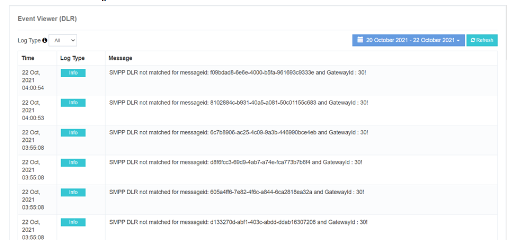

# Event Viewer (DLR)

The **iTextPRO Event Viewer (DLR)** provides valuable insights into **errors encountered during Delivery Report (DLR) updates**.  
It captures **comprehensive event details**, enabling efficient troubleshooting and ensuring seamless DLR processing.

---

## Key Features
- **DLR Event Monitoring** – Tracks all DLR update events in the system.
- **Detailed Error Capture** – Records precise error information for analysis.
- **Troubleshooting Support** – Facilitates quick and accurate problem resolution.
- **Admin Time Zone** – All logs are displayed according to the admin’s time zone.

---

## Benefits
- **Swift Issue Identification** – Quickly detect and address DLR-related problems.
- **Streamlined Troubleshooting** – Speeds up the resolution process.
- **Robust DLR Functionality** – Maintains accuracy and reliability of delivery reports.

---

> **Note:** Regularly reviewing the **Event Viewer (DLR)** is essential to maintain DLR update reliability and promptly address any issues.
