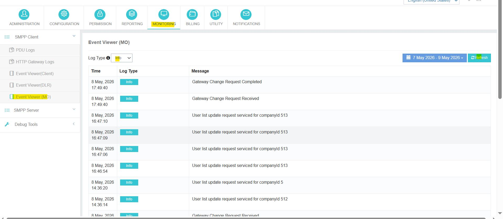
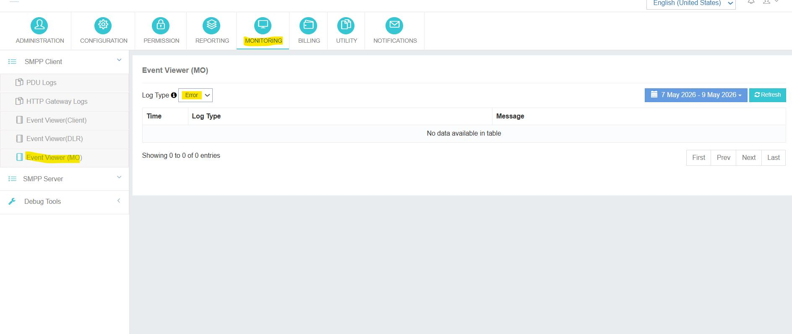

---
tags:
  - Monitoring
  - MO
  - Event Viewer
---

# Visionneuse d'événements (MO) — Mobile Originated

**Navigation:**  - Oui.  - Oui. .

## Aperçu général

Les **Visionneuse d'événements (MO)** section est utilisée pour surveiller **Mobile Originated (MO)** messages et événements liés au système dans PowerSMPP. Les messages MO sont des messages entrants reçus d'un fournisseur de passerelle ou d'un utilisateur final dirigé vers l'application.

---

## Objet

L'Event Viewer (MO) aide les administrateurs à surveiller, vérifier et dépanner toutes les activités de MO entrantes dans le système.

!!! info "Cas d'utilisation principale"
    - Surveillance des messages MO en temps réel
    - Vérification des journaux de communication utilisateur ou fournisseur entrants
    - Dépannage des problèmes de livraison ou de routage liés aux MO
    - Examen des événements MO générés par le système
    - Vérification des journaux de communication de passerelle pour le trafic entrant

---

## Informations disponibles

Le module affiche les champs suivants pour chaque entrée de journal:

| Champ | Désignation des marchandises |
|-------|-------------|
| **Heure** | Chronologie exacte de l'événement MO. |
| **Type de journal** | Classement de l'événement —  ou . |
| **Message** | Description de l'événement ou de l'activité MO. |

---

## Types de journaux

| Type de journal | Désignation des marchandises |
|----------|-------------|
| **Informations** | Événements système d'information, modifications réussies de passerelle, mises à jour de la liste des utilisateurs. |
| **Erreur** | Événements de niveau d'erreur indiquant des défaillances, des messages MO rejetés ou des exceptions système. |

---

## Caractéristiques

!!! info "Capacités du visionneur d'événements (MO)"
    - Afficher les journaux d'événements MO en temps réel.
    - Surveiller les activités de passerelle et d'entrée des utilisateurs.
    - Suivre les demandes de messages MO entrants.
    - Dépanner et résoudre les problèmes liés aux MO.
    - Rafraîchir les journaux sur demande en utilisant **Actualiser** bouton.
    - Filtrer les journaux par **type de journal** (Info / Erreur).
    - Filtrer les journaux par **date** pour examen historique.

---

## Filtre de portée de date

Les administrateurs peuvent sélectionner une plage de dates à récupérer **registres historiques des événements MO**. Cela appuie le dépannage rétrospectif, la vérification de la conformité et l'examen opérationnel.

!!! tip
 Lorsque vous cherchez un problème intermittent, définissez **Type de journal = Erreur** d'abord se concentrer uniquement sur les échecs, puis s'élargir à **Tous** si aucune erreur n'est visible pendant la fenêtre.
