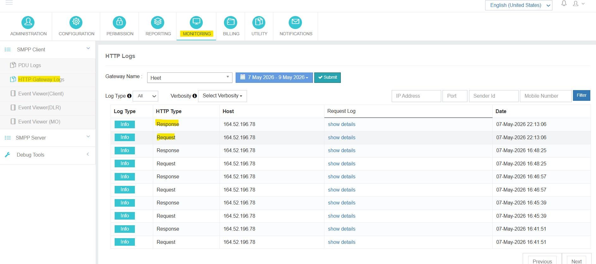
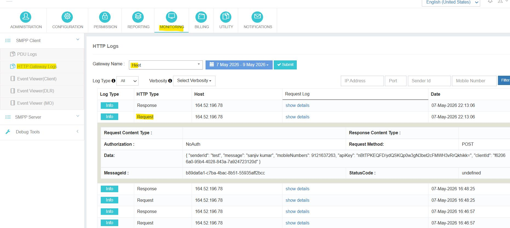
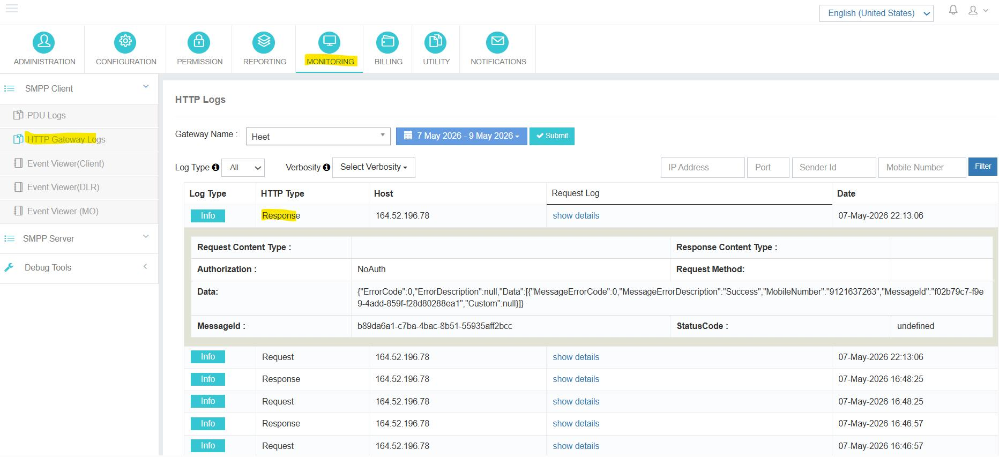

---
tags:
  - Monitoring
  - HTTP
  - Gateway
  - Logs
---

# HTTP 閘道器日誌

**導航 :**  ➔  ➔ 。 。 。 。

## 概覽

這個 **HTTP 閘道器日誌** 區域允許管理員檢視完整的 HTTP **請求** 財務報告和審定財務報表 **回應** PowerSMPP應用程式與已配置的閘道器供應商之間交流. 這些記錄對於診斷交付失敗、核實API有效載荷和審計閘道器互動至關重要。

---

## 檢視日誌的步驟

1. 選擇 **HTTP 閘道器** 從 **閘道器名稱** 放下槍
2. 選擇需要的 **日期範圍** 使用取棗機。
3. 選擇 **日誌型別** (單位:千美元) 編號 :  編號 : 視需要而定。
4. 選擇 **線性** 如果需要進行顆粒過濾,則級別。
5. 點選 **提交** 以獲取並顯示匹配日誌。

---

## 可用的日誌區域

### 請求正文

這個 **請求正文** 包含從PowerSMPP應用程式傳輸到閘道器供應商的完整有效載荷。

!!! info "請求正文 - 包含資料"
    - **移動號碼** ——簡訊的目的地編號
    - **發件人標識** – 使用的原地址/發件人ID
    - **請求引數** ——傳送到閘道器的完整API引數
    - **主機/ IP 細節** ——閘道器端點的IP地址和埠
    - **提交時間** - 發出請求的時間戳

### 反應機構

這個 **反應機構** 包含閘道器供應商提供的確認和狀態資料。

!!! info "反應機構——包括資料"
    - **閘道器響應** - 閘道器返回的原始反應
    - **狀況資訊** - 交付或接受狀態程式碼
    - **錯誤細節** — 錯誤程式碼和失敗的提交描述
    - **鳴謝** ——確認閘道器處理請求.

---

## 過濾選項

管理員可以使用下列附加過濾器來改進日誌檢視:

| 過濾器 | 使用 |
|--------|-----|
| **IP 地址** | 透過閘道器伺服器 IP 過濾日誌 。 |
| **發件人標識** | 透過發件人ID過濾日誌. |
| **移動號碼** | 按目的地移動編號過濾日誌 。 |

---

## 典型的解決問題

1. 一場運動報道出乎意料的失敗或未傳達的資訊.
2. 開啟 **HTTP 閘道器日誌**,選擇受影響的閘道器和涵蓋該問題的日期範圍。
3. 設定 **日誌型別** 改為  到表面只顯示失敗的交換。
4. 擴充套件 **請求正文** 證實外出有效載荷是正確的。
5. 擴充套件 **反應機構** 讀取供應商返回的實際錯誤程式碼/描述。
6. 使用 **IP 地址**, (中文(簡體) ). **發件人標識**,或 **移動號碼** 過濾器,為供應商的支助小組隔離特定測試樣本。
