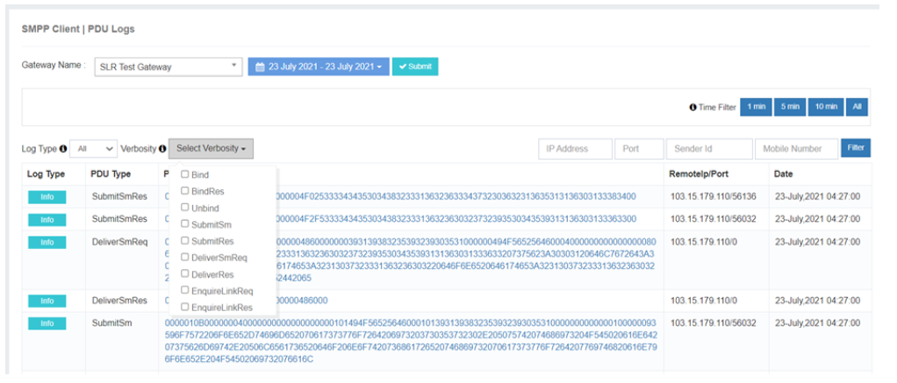

# Monitoring

iTextPRO provides comprehensive **monitoring tools** to ensure optimal SMS delivery performance and system stability. This includes **real-time Live Monitoring** for traffic insights and a robust **PDU Logger** for deep message-level analysis.

---

## Live Monitoring

The **Live Monitoring** module in iTextPRO dynamically tracks and analyzes key data points related to SMS traffic, enabling **real-time decision-making** for routing and performance optimization.

### Key Benefits
- **Proactive Traffic Management** – Manage SMS traffic dynamically based on live data.
- **Optimized Routing** – Make informed routing decisions to improve delivery rates.
- **Efficient Resource Allocation** – Allocate resources strategically during peak hours.
- **Enhanced Performance** – Improve responsiveness and throughput with real-time insights.

**In summary**, Live Monitoring ensures users have **up-to-the-minute visibility** into SMS traffic flow, especially during high-demand periods.

---

## PDU Logs

iTextPRO employs a **PDU (Protocol Data Unit) Logger** to capture and log every message entering or leaving the SMSC. This tool is vital for **troubleshooting**, **monitoring**, and **maintaining** system health.

### Key Features
- **Real-time Message Journey** – Logs every message in real time for immediate analysis.
- **Filtering Capabilities** – Trace the journey of a message with one click.
- **PDU Type Support** – Inspect SubmitSM, DeliverSM, Bind, Unbind, and more.
- **Visibility & Retention** – Logs follow the **admin time zone** and are retained for **3 days**.
- **Upstream Traffic Inspection** – View message flow by selecting gateways from a drop-down list.
- **Troubleshooting Support** – Quickly diagnose delivery or SMPP session issues.

### Usage Guidelines
1. Access the **PDU Logger** from the iTextPRO interface.
2. Apply **filters** to isolate and inspect specific messages.
3. Use **Upstream traffic logs** to verify message journeys.
4. Perform **regular monitoring** to maintain system reliability.

---

## Verbosity Levels in PDU Logging

iTextPRO’s PDU logging supports multiple **verbosity levels**, providing detailed insights into communication between iTextPRO and SMPP gateways.

| Verbosity Level | Purpose | Action |
|-----------------|---------|--------|
| **Bind Request** | Initiates SMPP binding | iTextPRO sends a request to connect to the SMPP gateway |
| **Bind Response** | Confirms SMPP binding | SMPP gateway responds to the bind request |
| **Enquire Link Request / Response** | Health check of SMPP session | iTextPRO sends request every 30s; gateway responds |
| **Submit_SM Request** | Message submission request | iTextPRO sends an SMS to the SMPP gateway |
| **Submit_SM Response** | Submission acknowledgment | Gateway responds to message submission |
| **Deliver_SM Request** | Delivery Report (DLR) reception | SMPP gateway sends delivery status |
| **Deliver_SM Response** | Acknowledgment of DLR | iTextPRO confirms receipt of DLR |
| **Unbind Request** | Session termination | iTextPRO or gateway initiates unbind request |

**Importance:** These logs give administrators a **granular view of message flows**, helping detect, diagnose, and resolve issues efficiently.

---

With **Live Monitoring** and **PDU Logging**, iTextPRO empowers administrators to maintain a **highly reliable SMS delivery system**, proactively detect issues, and optimize traffic in real time.
