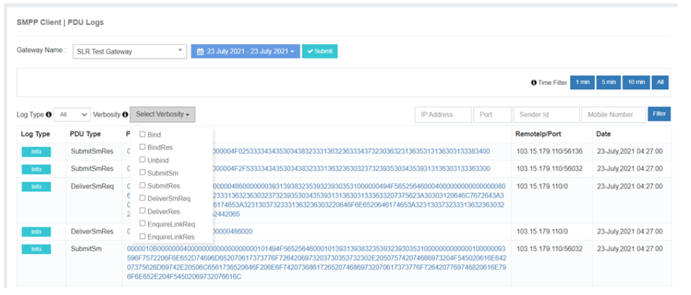

---
tags:
  - Monitoring
  - PDU
  - Troubleshooting
---

# 监测

iTextPRO 提供全面 **监测工具** 以确保最佳的短信传送性能和系统稳定性。 这包括: **实时现场监测** 对交通的洞察力和强大的 **PDU 标记器** 深层信息分析。

---

## 现场监测

这个 **现场监测** 模块在 iTextPRO 动态跟踪和分析与短消息流量相关的关键数据点,启用 **实时决策** 用于路由和性能优化。

### 主要惠益
- **主动交通管理** ——根据活数据动态管理短信流量.
- **优化路线** - 作出知情的路线决定来提高交付率。
- **高效的资源分配** - 在高峰时段战略性地分配资源。
- **增强业绩** ——以实时见识提高反应能力和吞吐量.

**总结**,现场监测确保用户 **随时可见** 进入短消息流量,特别是在高需求时期.

---

## PDU 日志

iTextPRO 使用一个 **PDU (协议数据单位) 记录器** 以获取和记录每条进出短信。 这个工具对 **排除出问题**, (中文(简体) ). **监测**,以及 **维持** 系统健康。

### 关键特性
- **实时信件行程** - 实时记录每条信息,以便立即进行分析。
- **过滤能力** – 点击一键追踪消息的行程 。
- **PDU 类型支持** – 检查StoppetSM,交付SM,平德,Unbind等.
- **可见和保留** - 日志跟随 **管理时区** 并保留用于 **3天时间**。 。 。 。
- **上游交通检查** – 通过从下拉列表中选择网关来查看消息流.
- **解决问题支持** - 快速诊断分娩或SMPP会话问题。

### 使用准则
1. 进入 **PDU 标记器** 从 iTextPRO 界面。
2. 应用 **过滤器** 以隔离和检查特定信息。
3. 使用 **上游交通记录** 以验证信件行程。
4. 执行 **定期监测** 保持系统可靠性。

---

## PDU 日志中的Verbosity 级别

iTextPRO 的 PDU 记录支持多个 **动词水平**,提供了对iTextPRO和SMPP网关之间通信的详细见解.

| Verbosity 级别 | 目的 | 行动 |
|-----------------|---------|--------|
| **绑定请求** | 启动 SMPP 绑定 | iTextPRO 发送连接 SMPP 网关的请求 |
| **绑定响应** | 确认 SMPP 绑定 | SMPP 网关响应绑定请求 |
| **询问链接请求/答复** | SMPP会议的健康检查 | iTextPRO 每30s发送请求;网关响应 |
| **提交( S) 请求** | 信件提交请求 | iTextPRO 向 SMPP 网关发送短消息 |
| **提交 SM 回复** | 提交确认 | 网关响应信件提交 |
| **交付 SM 请求** | 交付报告(DLR)接收 | SMPP 网关发送送出状态 |
| **交付 SM 回应** | 承认德国航天中心 | iTextPRO 确认收到 DLR |
| **撤销请求** | 会话终止 | iTextPRO 或网关启动未连接的请求 |

**重要性 :** 这些日志给管理员一个 **消息流的颗粒视图**帮助有效发现、诊断和解决问题。

---

与 **现场监测** 财务报告和审定财务报表 **PDU 日志**,iTextPRO 授权管理员维护 **高度可靠的短信传送系统**,主动发现问题,优化实时流量.
