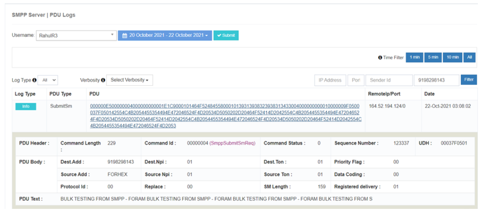

# Registres PDU du serveur

Les **Logs de PDU du serveur SMPP** dans iTextPRO sont essentiels pour **surveillance et dépannage** transactions de messages entre les **Utilisateur ESME (External Short Message Entity)** et la plateforme iTextPRO. 
Ces journaux capturent **trafic en aval** et fournir des détails granulaires qui aident à résoudre efficacement les problèmes.

---

## Caractéristiques principales
- **Enregistrement des transactions complet** – Enregistre chaque transaction de message entre l'utilisateur ESME et iTextPRO.
- **Support de dépannage** – Critique pour diagnostiquer et résoudre les problèmes de communication.
- **Zone horaire administrative** – Les journaux sont affichés dans le fuseau horaire de l'administrateur pour une référence précise.

---

## Trafic en aval
Suivre la **voyage des messages** de l'utilisateur ESME à iTextPRO, fournissant une visibilité sur le débit et l'état de livraison.

---

## Niveaux de converbité

Comprendre **niveaux de verbosité** aide à la surveillance et au dépannage:

| **Niveau de converbosité** | **Désignation des marchandises** | **Objet** |
|---------------------|-----------------|-------------|
| **Demande de reliure** | L'utilisateur ESME lance la connexion. | Établit un lien avec iTextPRO. |
| **Réponse du bind** | iTextPRO répond à la demande de connexion. | Reconnaît la connexion de l'utilisateur ESME. |
| **Demande de lien** / **Réponse** | Contrôle de santé de l'utilisateur ESME et réponse correspondante. | Vérifier l'état de la session iTextPRO (intervalle recommandé : 30 secondes). |
| **Soumettre SM Demande** | L'utilisateur ESME lance une demande de message. | Envoie des messages SMS à iTextPRO. |
| **Soumettre SM Réponse** | iTextPRO répond à la demande de message. | Accepte la soumission de SMS. |
| **Livraison SM Demande** | DLR (rapport de livraison) reçu par iTextPRO pour un message soumis. | Mise à jour de l'état de livraison des SMS soumis. |
| **Livraison SM Réponse** | L'utilisateur ESME accepte la demande DLR. | Confirme l'état de livraison. |
| **Demande non consolidée** | L'utilisateur ESME lance une requête non liée. | Termine les sessions connectées. |

---

## Meilleures pratiques
- **Examiner régulièrement les journaux** – Assurer une surveillance robuste et la détection rapide des problèmes liés aux transactions.
- **Tirer parti de la converbosité** – Utilisez les détails PDU capturés pour maintenir une communication efficace entre ESME et iTextPRO.
- **Action rapide** – S'attaquer aux anomalies dès qu'elles sont détectées pour maintenir une performance optimale du système.
