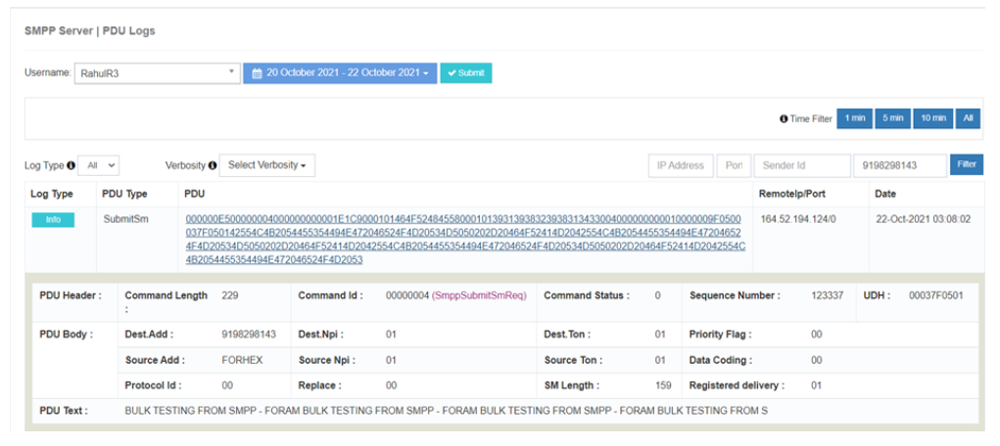

# Server PDU Logs

The **SMPP Server PDU Logs** in iTextPRO are essential for **monitoring and troubleshooting** message transactions between the **ESME (External Short Message Entity) user** and the iTextPRO platform.  
These logs capture **downstream traffic** and provide granular details that aid in efficient issue resolution.

---

## Key Features
- **Comprehensive Transaction Logging** – Records every message transaction between the ESME user and iTextPRO.
- **Troubleshooting Support** – Critical for diagnosing and resolving communication issues.
- **Admin Time Zone** – Logs are displayed in the administrator’s time zone for accurate reference.

---

## Downstream Traffic
Tracks the **journey of messages** from the ESME user to iTextPRO, providing visibility into delivery flow and status.

---

## Verbosity Levels

Understanding the **verbosity levels** helps in monitoring and troubleshooting:

| **Verbosity Level** | **Description** | **Purpose** |
|---------------------|-----------------|-------------|
| **Bind Request** | ESME user initiates connection. | Establishes connection with iTextPRO. |
| **Bind Response** | iTextPRO responds to connection request. | Acknowledges ESME user's connection. |
| **Enquire Link Request** / **Response** | Health check call from ESME user and corresponding response. | Verifies iTextPRO session status (recommended interval: 30 seconds). |
| **Submit_SM Request** | ESME user initiates message request. | Sends SMS messages to iTextPRO. |
| **Submit_SM Response** | iTextPRO responds to message request. | Acknowledges SMS submission. |
| **Deliver_SM Request** | DLR (Delivery Report) received by iTextPRO for a submitted message. | Updates delivery status for submitted SMS. |
| **Deliver_SM Response** | ESME user acknowledges DLR request. | Confirms receipt of delivery status. |
| **Unbind Request** | ESME user initiates unbind request. | Terminates connected sessions. |

---

## Best Practices
- **Regularly Review Logs** – Ensures robust monitoring and quick detection of transaction-related issues.
- **Leverage Verbosity Insights** – Use the captured PDU details to maintain effective communication between ESME and iTextPRO.
- **Prompt Action** – Address anomalies as soon as they are detected to maintain optimal system performance.
