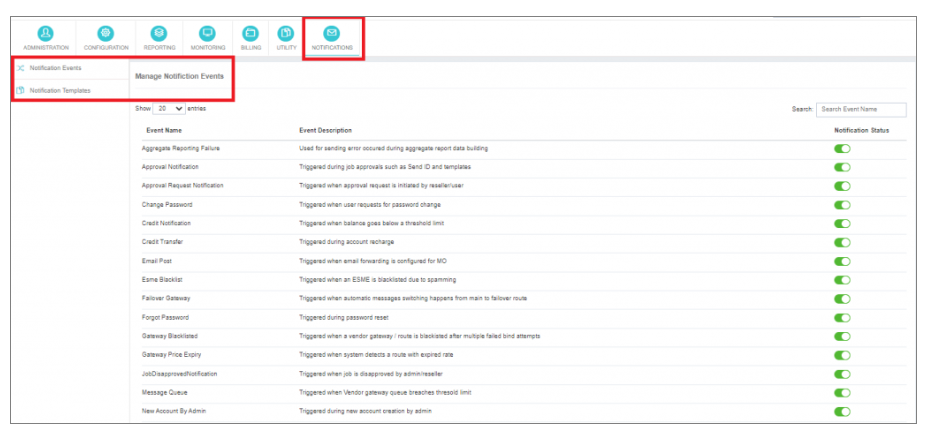

# Notifications Events

The **"Notifications"** module in iTextPro serves as a proactive monitoring system, regularly assessing critical parameters of the application across various data points.  
This module is designed to trigger timely alerts to relevant stakeholders via email, ensuring prompt action and preventing potential issues from escalating.

## Manage Notification Events

