# Plantillas de correo electrónico

## Características clave

### Supervisión automatizada
- **iTextPro** monitoriza continuamente los parámetros críticos de la aplicación a intervalos regulares.
- La identificación proactiva de posibles problemas antes de que se intensifiquen.

### Alertas vía correo electrónico
- Los interesados reciben alertas mediante notificaciones por correo electrónico.
- Las notificaciones se envían por adelantado, lo que permite a los interesados adoptar medidas preventivas.

### Gestión de plantillas personalizadas
- Admite plantillas de alerta personalizables.
- Los usuarios pueden gestionar y adaptar plantillas de notificación según sus requisitos.

### Integración de variables
- Las plantillas personalizadas pueden incluir variables relevantes del sistema.
- Comunicación personalizada mediante información de sistema actualizada dinámicamente.

---

## Directrices de uso

### Gestión de plantillas
- Personalizar plantillas de alerta para satisfacer necesidades específicas de comunicación.
- Incorporar las variables pertinentes del sistema para notificaciones dinámicas y de información contextual.

### Participación de los interesados
- Ensure that concerned stakeholders are configured to receive notifications.
- Verifique que los ajustes de correo electrónico están correctamente configurados para la comunicación perfecta.

---

## Beneficios
- Mejora la fiabilidad y estabilidad de la **iTextPro** aplicación.
- Proporciona un mecanismo proactivo para la detección y alerta de problemas.
- Las plantillas y variables de sistema personalizables permiten la comunicación personalizada e informativa.
- Ayuda a las organizaciones a seguir adelante con posibles desafíos.

!!! note
 Los detalles SMTP son obligatorios para Admin y para las cuentas de revendedor para activar correos electrónicos.

---

## Gestión de plantillas de correo electrónico

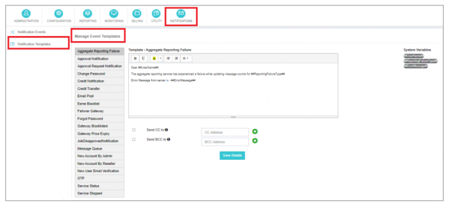

---

## Notificación Eventos y Plantillas Correspondientes

### Fallo de presentación de informes
Encadenado cuando el servicio de información global encuentra un fracaso desconocido. 
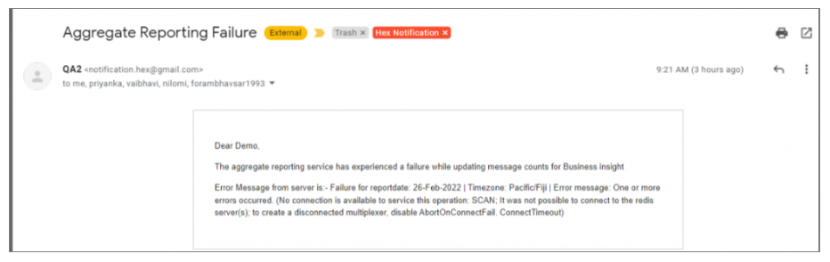

### Notificación de aprobación
Enviado a la aprobación del administrador del ID de remitente y solicitudes de plantilla. 
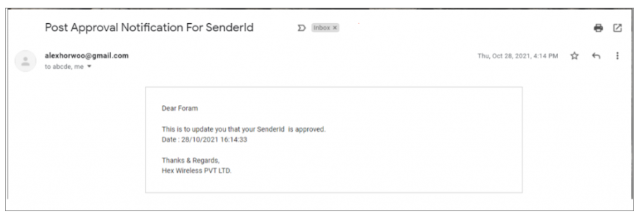 
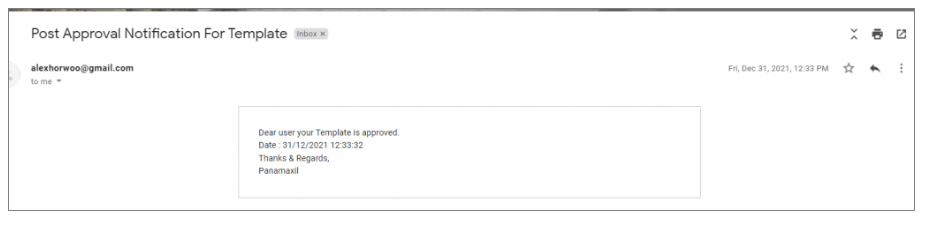

### Solicitud de aprobación Notificación
Encadenado cuando un revendedor/usuario inicia una solicitud de identificación del remitente o aprobación de la plantilla. 
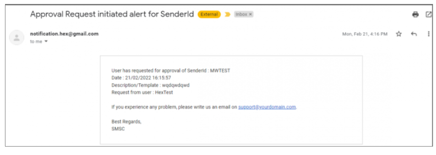 
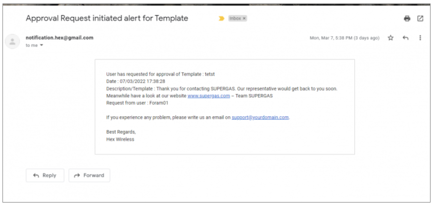

### Cambiar contraseña
Se envía cuando un usuario cambia con éxito su contraseña. 
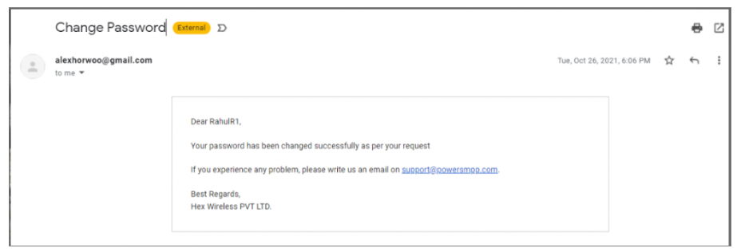

### Notificación de crédito
Alertado cuando el saldo disponible de un usuario cae por debajo del umbral de crédito. 
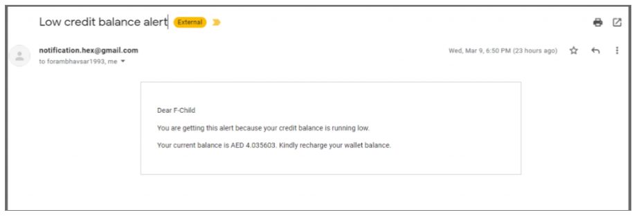

### Transferencia de crédito
Encadenado a la adición de saldo a una cuenta de usuario por el usuario o revendedores. 
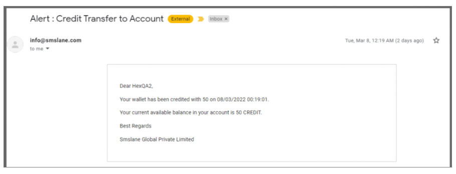

### Correo electrónico
Enviado al recibir un mensaje entrante (MO) cuando el envío de correo electrónico MO está activo. 
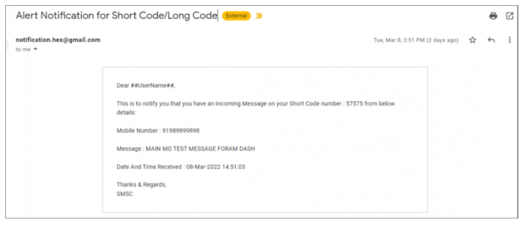

### Esme Blacklist
Alertado cuando una cuenta ESME es lista negra debido a spamming. 
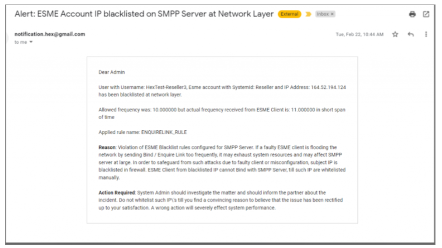

### Failover Gateway
Encadenado cuando el cambio automático de mensaje ocurre debido a una salida de puerta principal. 
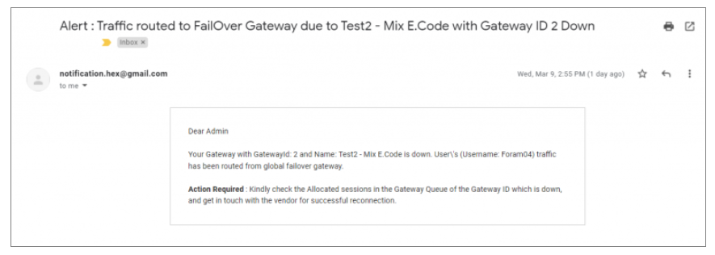

### Olvidé la contraseña
Se envía cuando hay una solicitud para cambiar la contraseña de la cuenta de inicio de sesión. 
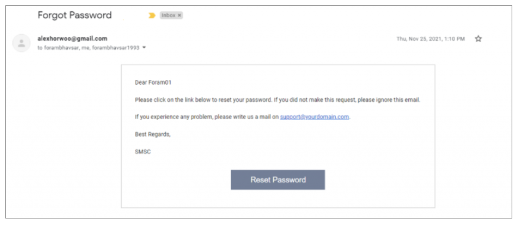

### Gateway Blacklisted
Alertado cuando una puerta/ruta de vendedor SMPP es lista negra después de fallidos intentos de atadura. 
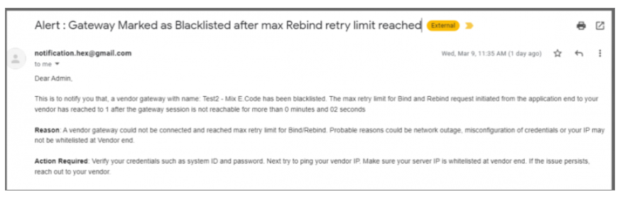

### Gateway Price Expiry
Encadenado cuando se detecta una ruta con una tasa caducada. 
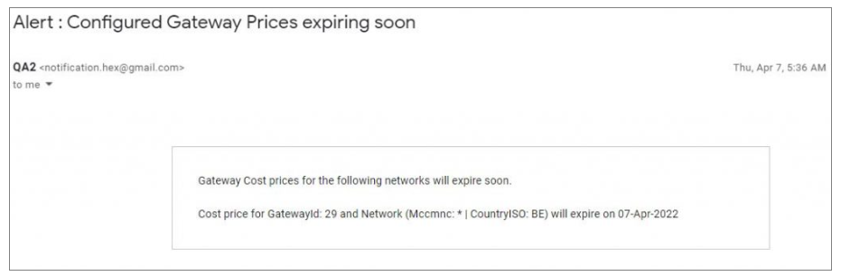

### Aviso desaprobado por Job
Se envía cuando un ID de remitente o una solicitud de plantilla es desaprobado por el administrador/reseller. 
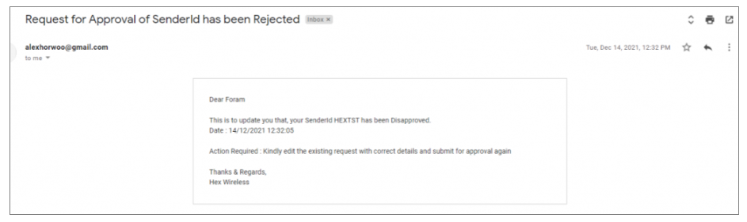 
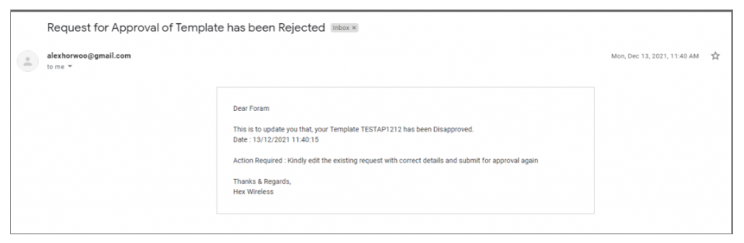

### Mensaje de búsqueda
Encadenado cuando la cola de entrada del vendedor viola el límite del umbral. 
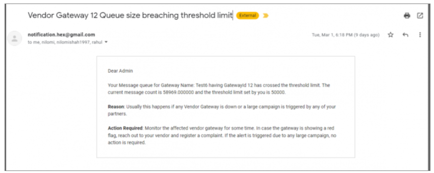

### Nueva Cuenta por Admin
Se envía cuando se agrega un nuevo usuario de la administración o se registra. 
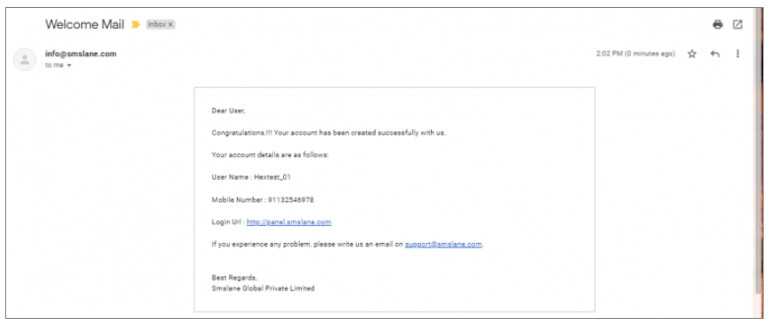

### Nueva cuenta por revendedor
Se envía a los usuarios del revendedor cuando un revendedor añade un nuevo usuario o un nuevo usuario se registra. 
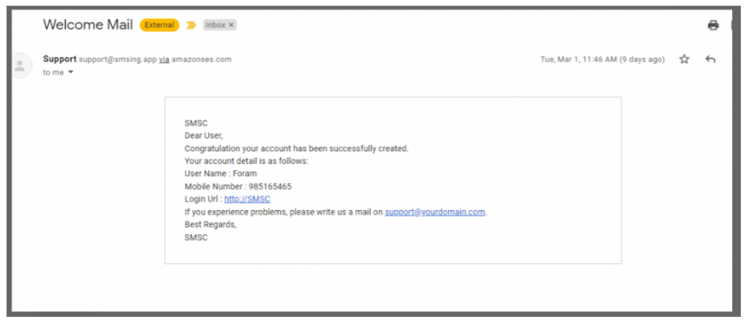

### Nueva verificación de correo electrónico de usuario
Prometido para nuevos usuarios que se inscriban para la verificación de correo electrónico. 
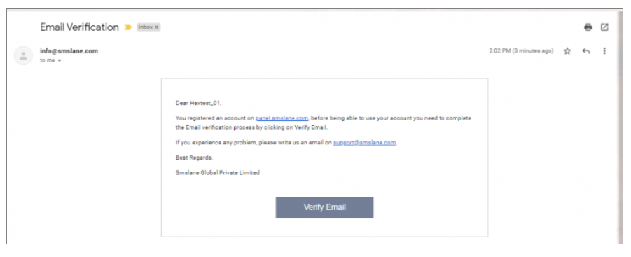

### OTP
Enviado para la verificación OTP durante los logins de usuario. 
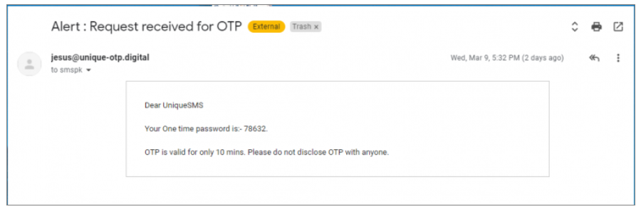

### Estado del servicio
Alertado cuando se recupera automáticamente un demonio/servicio.

### Servicio parado
Triggered cuando un demonio/servicio es detenido intencionalmente. 
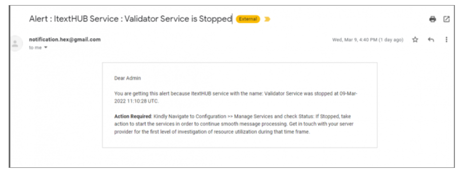

### Detección de spam
Alertado cuando se detecta el contenido de SPAM. 
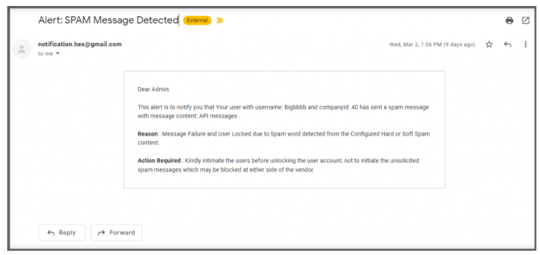

### Actualización de ventas de usuarios
Se envía cuando el precio de venta del cliente es actualizado por la cuenta padre. 
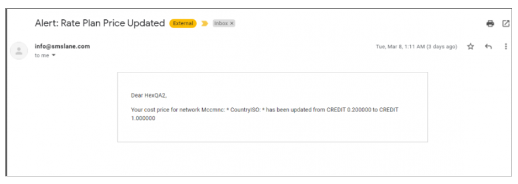

---

Estas notificaciones abarcan una amplia gama de acontecimientos, proporcionando información completa y alertas oportunas para asegurar una supervisión y gestión eficientes de la **iTextPro** plataforma.
