# Email Templates

## Key Features

### Automated Monitoring
- **iTextPro** continuously monitors critical parameters of the application at regular intervals.
- Proactive identification of potential issues before they escalate.

### Alerts via Email
- Stakeholders receive alerts through email notifications.
- Notifications are sent in advance, allowing stakeholders to take preventive measures.

### Custom Template Management
- Supports customizable alert templates.
- Users can manage and tailor notification templates according to their requirements.

### System Variables Integration
- Custom templates can include relevant system variables.
- Personalized communication through dynamically updated system information.

---

## Usage Guidelines

### Template Management
- Customize alert templates to suit specific communication needs.
- Incorporate relevant system variables for dynamic and context-aware notifications.

### Stakeholder Engagement
- Ensure that concerned stakeholders are configured to receive notifications.
- Verify that email settings are correctly configured for seamless communication.

---

## Benefits
- Enhances the reliability and stability of the **iTextPro** application.
- Provides a proactive mechanism for issue detection and alerting.
- Customizable templates and system variables enable personalized and informative communication.
- Helps organizations stay ahead of potential challenges.

> **Note:** SMTP details are mandatory for Admin as well as for reseller accounts to trigger emails.

---

## Email Template Management

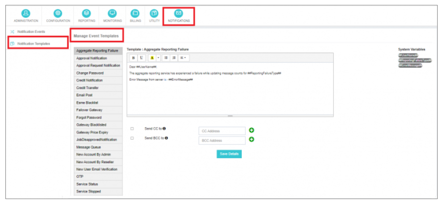

---

## Notification Events and Corresponding Templates

### Aggregate Reporting Failure
Triggered when the aggregate reporting service encounters an unknown failure.  
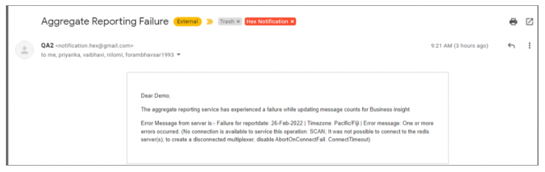

### Approval Notification
Sent upon admin approval of Sender ID and template requests.  
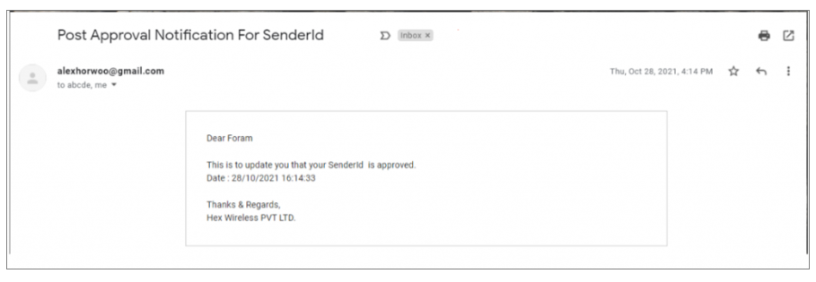  
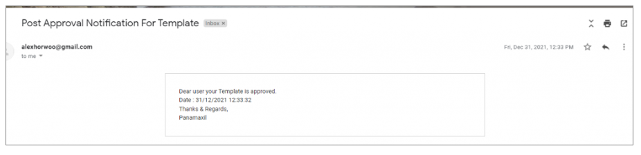

### Approval Request Notification
Triggered when a reseller/user initiates a Sender ID or template approval request.  
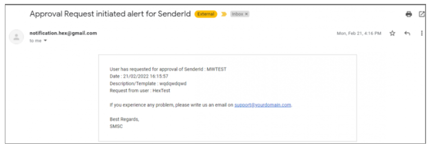  
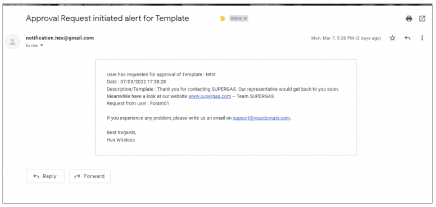

### Change Password
Sent when a user successfully changes their password.  
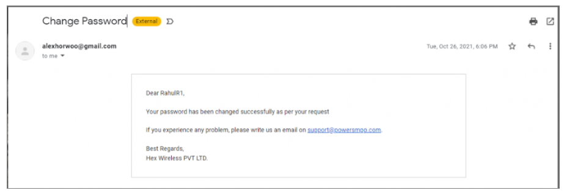

### Credit Notification
Alerted when a user's available balance falls below the credit threshold.  
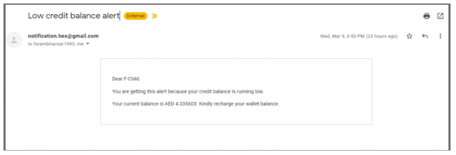

### Credit Transfer
Triggered upon the addition of balance to a user account by the user or resellers.  
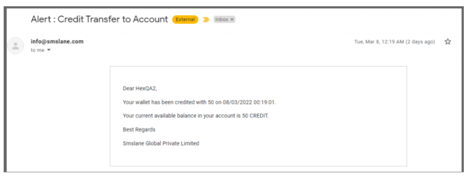

### Email Post
Sent upon receiving an incoming message (MO) when MO email forwarding is active.  
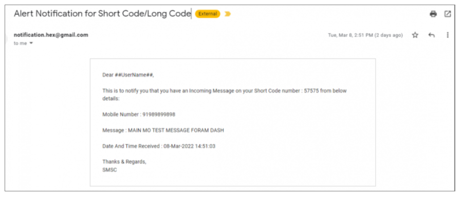

### Esme Blacklist
Alerted when an ESME account is blacklisted due to spamming.  
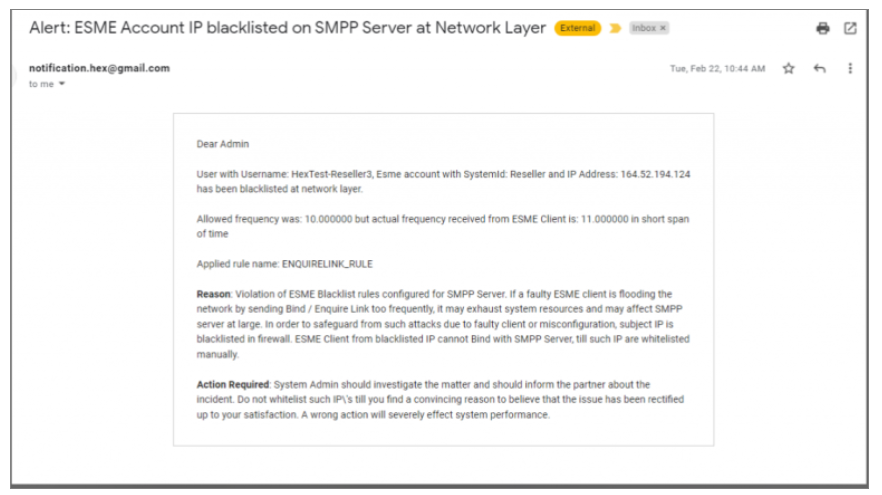

### Failover Gateway
Triggered when automatic message switching occurs due to a primary gateway outage.  
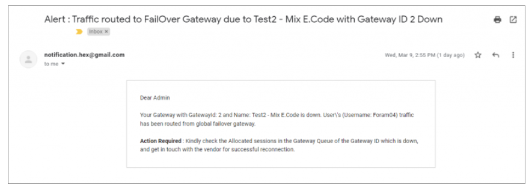

### Forgot Password
Sent when there is a request to change the login account password.  
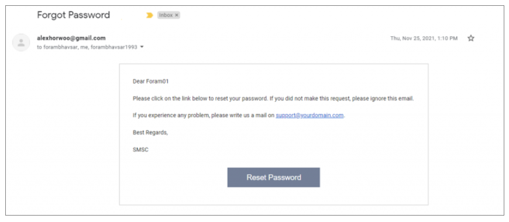

### Gateway Blacklisted
Alerted when an SMPP vendor gateway/route is blacklisted after failed bind attempts.  
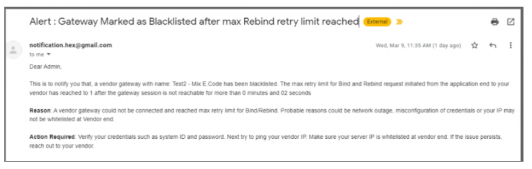

### Gateway Price Expiry
Triggered when a route with an expired rate is detected.  
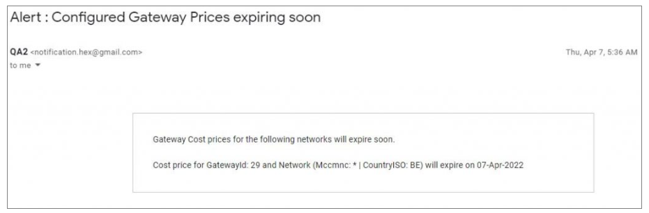

### Job Disapproved Notification
Sent when a sender ID or template request is disapproved by the admin/reseller.  
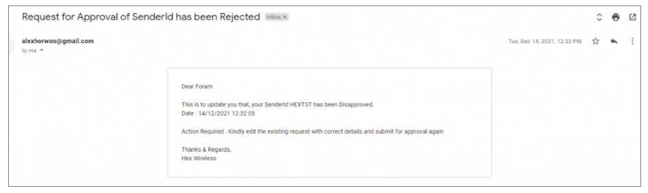  
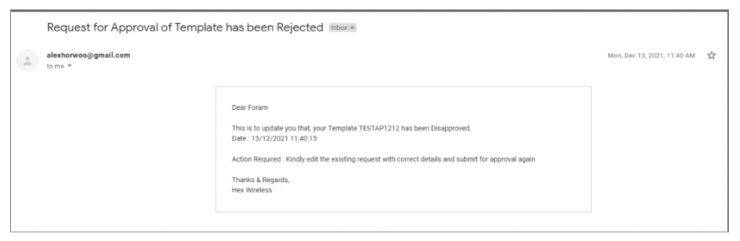

### Message Queue
Triggered when the vendor gateway queue breaches the threshold limit.  
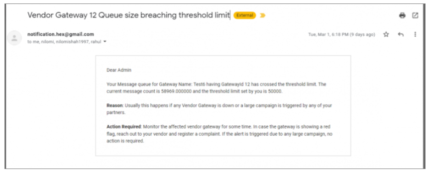

### New Account by Admin
Sent when a new user is added from administration or signs up.  
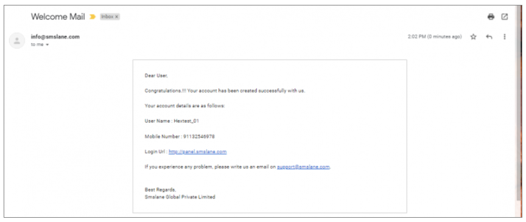

### New Account by Reseller
Sent to reseller users when a reseller adds a new user or a new user signs up.  
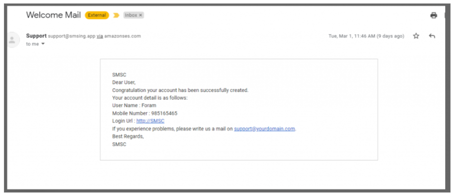

### New User Email Verification
Triggered for new users signing up for email verification.  
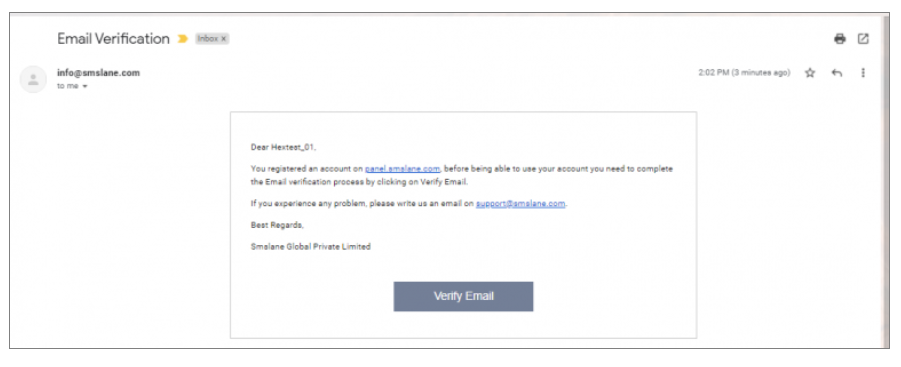

### OTP
Sent for OTP verification during user logins.  
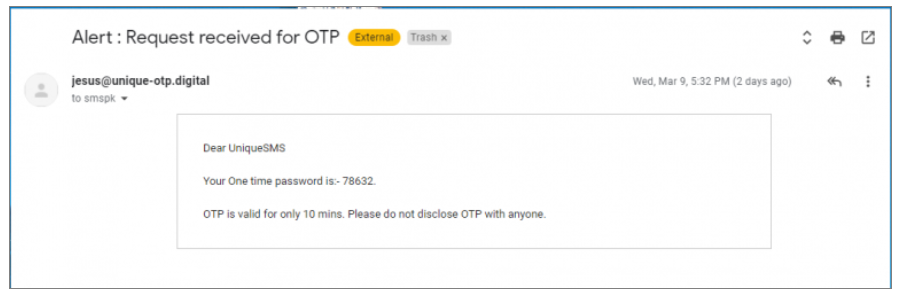

### Service Status
Alerted when a demon/service is automatically recovered.

### Service Stopped
Triggered when a demon/service is intentionally stopped.  
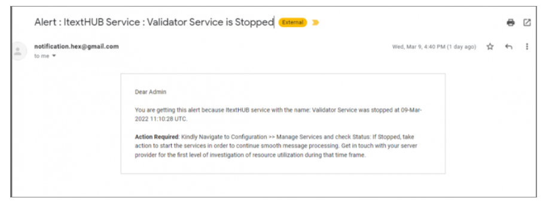

### Spam Detection
Alerted when SPAM content is detected.  
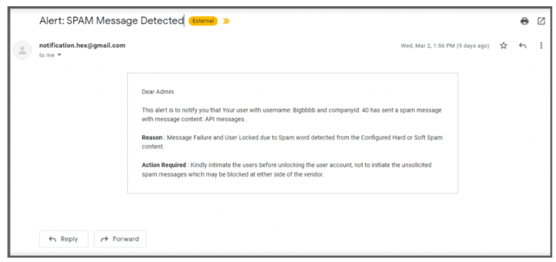

### User Selling Update
Sent when the customer selling price is updated by the parent account.  
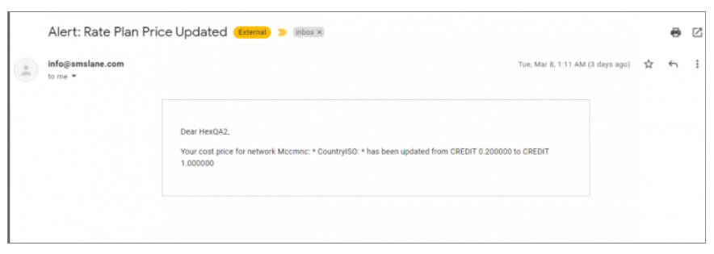

---

These notifications cover a wide range of events, providing comprehensive insights and timely alerts to ensure efficient monitoring and management of the **iTextPro** platform.
