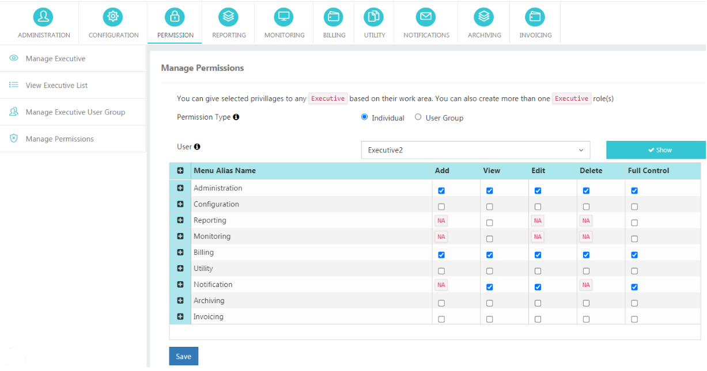
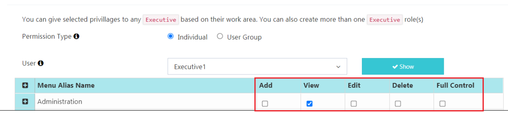
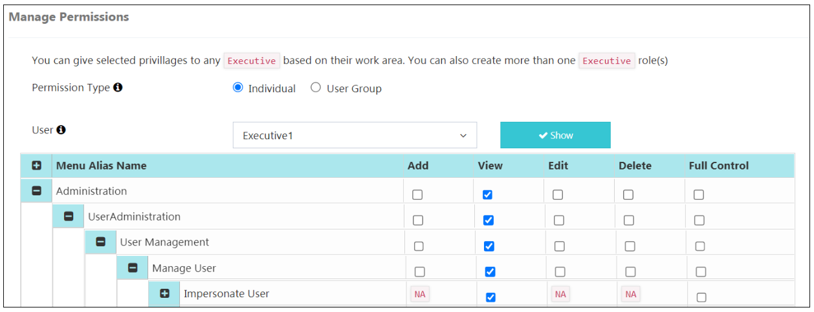
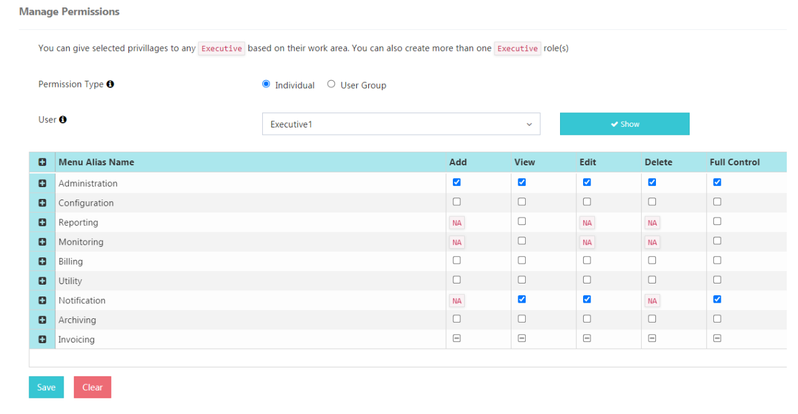
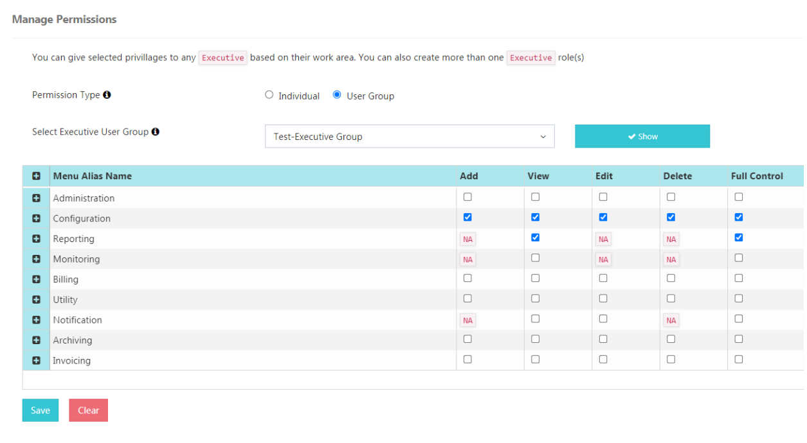
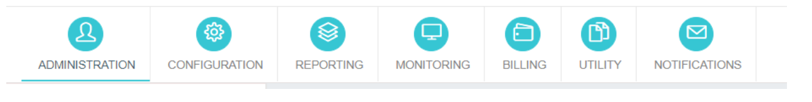
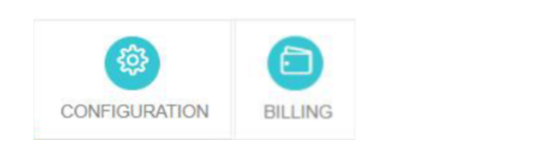

# Autorisations

## Rôle du compte Privilèges exécutifs dans iTextPRO

Dans **iTextPRO**, administrateurs et revendeurs peuvent accorder des privilèges spécifiques à **Rôle des cadres supérieurs**, en adaptant leur accès aux zones de travail désignées. 
Plusieurs rôles de direction peuvent être créés pour répondre à diverses responsabilités.

### Exemples de rôles

**Rôle de l'équipe financière**
- Accès à la section de facturation
- Section des rapports Accès
- Autres privilèges pertinents

**Rôle de l'équipe du CNO**
- Accès au journal de surveillance
- Section des rapports Accès
- Options d'administration
- Autres privilèges pertinents

**Procédures de connexion :**
- **Exécutif de l'administrateur :** Utilisez l'URL et le port de connexion Admin.
- **Revendeur :** Utilisez l'URL et le port de connexion Reseller.

Cette séparation assure aux cadres supérieurs une expérience de connexion sécurisée et spécifique à leur rôle, en rationalisant l'accès aux fonctionnalités alignées sur leurs responsabilités.

---

## Catégories de permis

Les autorisations pour les utilisateurs exécutifs dans iTextPRO sont classées en fonction du niveau d'accès et des actions au sein des modules.

### Catégories

**Affichage** 
- Peut afficher le contenu dans le module spécifié. 
- *Aucune modification ou suppression n'est autorisée.*

**Ajouter** 
- Peut ajouter de nouvelles entrées au module. 
- *Impossible de modifier ou de supprimer les entrées existantes.*

**Modifier** 
- Peut modifier/actualiser les entrées existantes. 
- *Pas de droits de suppression.*

**Supprimer** 
- Peut supprimer les entrées du module. 
- *Pas de droits d'édition.*

**Contrôle total** 
- Afficher, ajouter, modifier et supprimer les droits pour le module spécifié. 
- Accès sans restriction.

---

## Contrôle et hiérarchie complets

Dans **iTextPRO**, **Contrôle total** offre un accès complet.

**Scénarios d'activation :**
1. Permettre le contrôle complet au **Niveau supérieur** l'octroie automatiquement à tous les sous-modules.
2. Il permet de **module spécifique** couvre Affichage, Ajouter, Modifier et Supprimer.

**Hiérarchie:**
- Les niveaux représentent différentes sections, fonctionnalités ou catégories de données.
- Contrôle total à un niveau supérieur cascades à tous les niveaux.

**Désactivation explicite :**
- Les autorisations spécifiques dans les sous-modules peuvent être désactivées manuellement, même avec Full Control.

---

## Types de permis

### Autorisations individuelles des utilisateurs
- Accorde des autorisations à un utilisateur exécutif particulier.

**Procédure:**
1. Allez à **Gérer la permission** page.
2. Sélectionner **Individuel** comme type de permission.
3. Choisissez un utilisateur dans la liste déroulante.
4. Cliquez sur **Afficher** pour voir / gérer les permissions.

---

### Autorisations du groupe d'utilisateurs exécutif
- Accorde des autorisations à un groupe; hérité par tous les membres du groupe.

**Procédure:**
1. Allez à **Gérer les groupes d'utilisateurs exécutifs** page.
2. Cliquez sur **Ajouter un groupe d'utilisateurs**.
3. Saisissez le nom de groupe et sélectionnez les utilisateurs.
4. Sauvez le groupe.
5. Utilisation **Total des utilisateurs** de consulter les membres.
6. Modifier ou supprimer les groupes au besoin.

Les *Si un cadre supérieur a à la fois des autorisations spécifiques à l'utilisateur et des autorisations de groupe, ils obtiennent les deux.*

---

## Visibilité du module

- Si un Exécutif manque de permissions, il verra une **"Accès refusé"** page lors de la connexion.
- Si les permissions sont révoquées pendant la connexion, les actions s'afficheront **"Accès refusé"**.
- Les modules sont affichés séquentiellement sur la base des autorisations accordées.

Exemple : 
- Si **Configuration** et **Facturation** sont accordés, seuls ces modules apparaissent.

 
