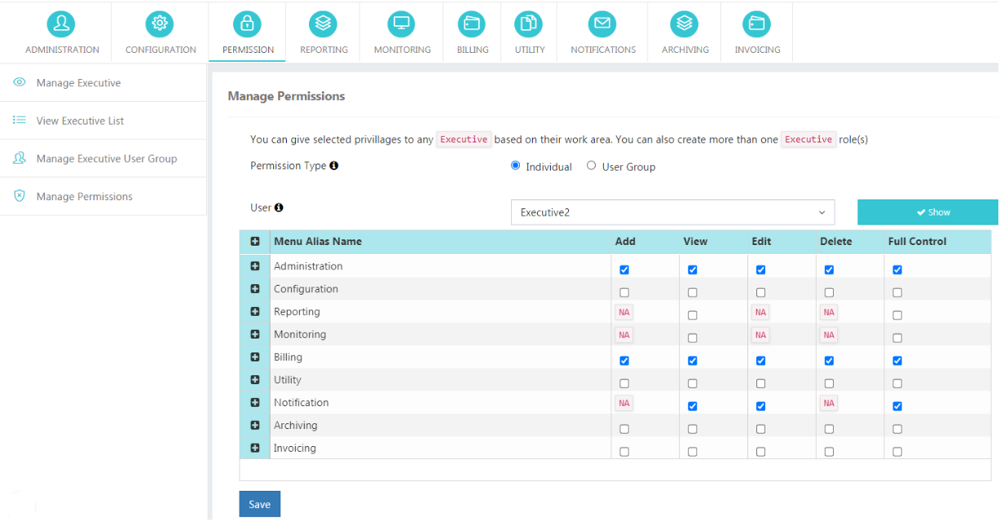
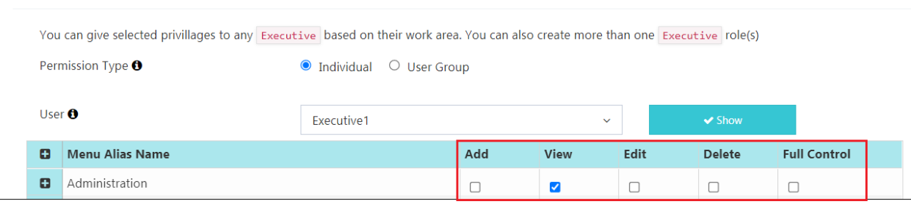
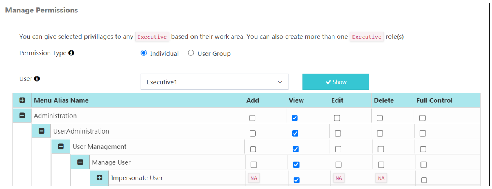
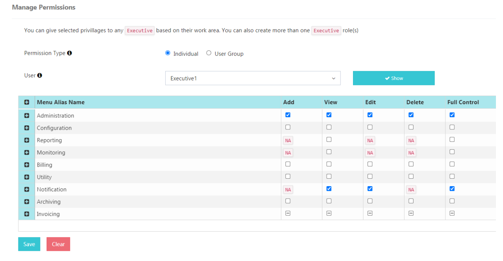
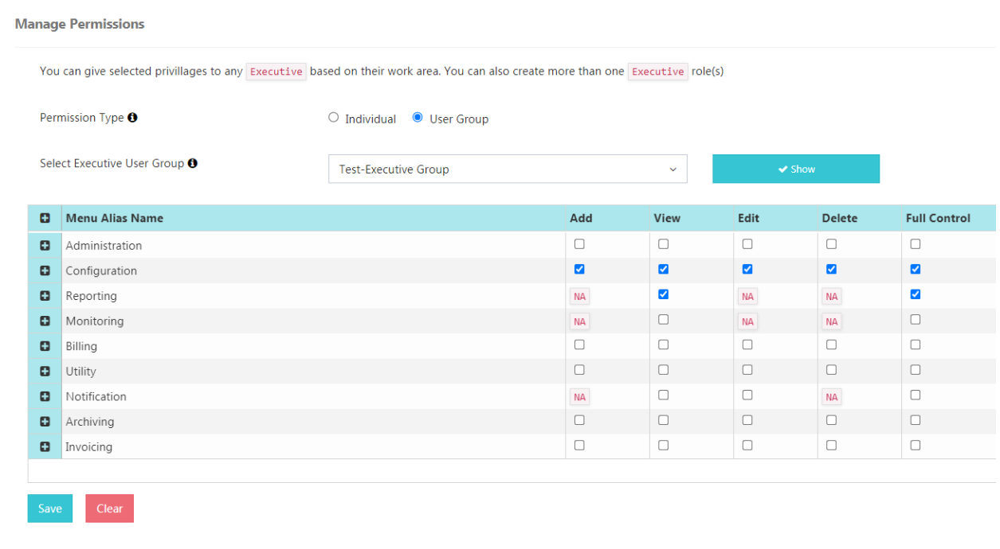

# Permissions

## Account Role Executive Privileges in iTextPRO

In **iTextPRO**, administrators and resellers can grant specific privileges to **Account Role Executives**, tailoring their access to designated work areas.  
Multiple Executive roles can be created to accommodate diverse responsibilities.

### Example Roles

**Finance Team Role**
- 📊 Billing Section Access
- 📈 Reporting Section Access
- Other Relevant Privileges

**NOC Team Role**
- 📜 Monitoring Log Access
- 📊 Reporting Section Access
- ⚙️ Administration Options
- Other Relevant Privileges

**Login Procedures:**
- **Admin's Executive:** Use the Admin’s Login URL and Port.
- **Reseller’s Executive:** Use the Reseller’s Login URL and Port.

This segregation ensures a secure and role-specific login experience for executives, streamlining access to functionalities aligned with their responsibilities.

---

## Permission Categories

Permissions for Executive users in iTextPRO are categorized based on access level and actions within modules.

### Categories

**View**  
- Can view contents within the specified module.  
- *No modifications or deletions allowed.*

**Add**  
- Can add new entries to the module.  
- *Cannot edit or delete existing entries.*

**Edit**  
- Can edit/update existing entries.  
- *No deletion rights.*

**Delete**  
- Can delete entries from the module.  
- *No edit rights.*

**Full Control**  
- Grants view, add, edit, and delete rights for the specified module.  
- Unrestricted access.

---

## Full Control & Hierarchy

In **iTextPRO**, **Full Control** provides comprehensive access.

**Activation Scenarios:**
1. Enabling Full Control at the **top level** automatically grants it to all sub-modules.
2. Enabling it for a **specific module** covers View, Add, Edit, and Delete.

**Hierarchy:**
- Levels represent different sections, functionalities, or data categories.
- Full Control at a higher level cascades to all sub-levels.

**Explicit Disabling:**
- Specific permissions in sub-modules can be disabled manually, even with Full Control.

---

## Permission Types

### Individual User Permissions
- Grants permissions to a specific executive user.

**Procedure:**
1. Go to **Manage Permission** page.
2. Select **Individual** as permission type.
3. Choose a user from the dropdown.
4. Click **Show** to view/manage permissions.

---

### Executive User Group Permissions
- Grants permissions to a group; inherited by all group members.

**Procedure:**
1. Go to **Manage Executive User Groups** page.
2. Click **Add User Group**.
3. Enter group name & select users.
4. Save the group.
5. Use **Total Users** to view members.
6. Edit or delete groups as needed.

📌 *If an executive has both user-specific and group permissions, they get both.*

---

## Module Visibility

- If an Executive lacks permissions, they will see an **"Access Denied"** page upon login.
- If permissions are revoked while logged in, actions will show **"Access Denied"**.
- Modules are displayed sequentially based on granted permissions.

Example:  
- If **Configuration** and **Billing** are granted, only those modules appear.

  
