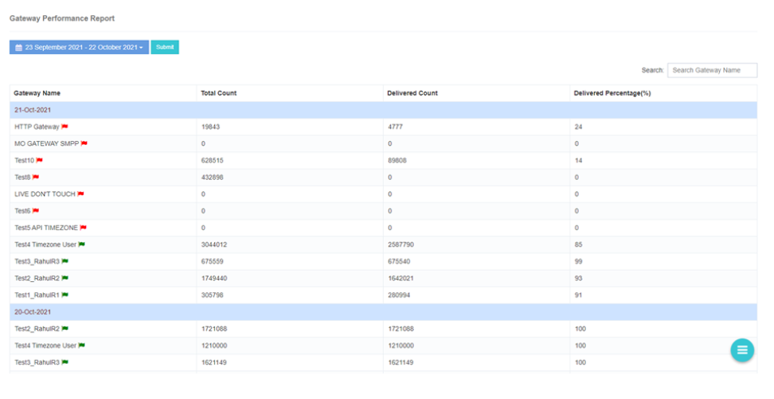

# Rapport d'étape de la passerelle

iTextPRO offre une **Rapport d'étape détaillé sur la passerelle**, permettant aux utilisateurs de rapidement **évaluer et comparer** la performance de différentes passerelles de fournisseurs.

## Catégories de résultats

### Meilleure performance
- **Pourcentage de livraison:** Sur **80%**
- Indique **performances exceptionnelles de livraison**.

### Bonne exécution
- **Pourcentage de livraison:** Sur **60%**
- Représente **Résultats louables**.

### Exécution moyenne
- **Pourcentage de livraison:** Sur **40%**
- Réflexions **résultats modérés**.

---

## Accès au rapport d'étape de la passerelle

1. Saisissez la **nom de la passerelle du fournisseur** dans la boîte de recherche. 
2. Sélectionner le produit désiré **date**. 
3. Soumettre la recherche pour générer une **rapport détaillé sur l ' exécution du budget** pour la passerelle sélectionnée. 

---

## Remarques importantes
- Les **nombre d'états du message** dans le rapport est affiché selon le **fuseau horaire de l'utilisateur**.

---

Les **Rapport d'étape de la passerelle** habilite les administrateurs à :
- **Comparer** performance du portail fournisseur.
- **Identifier** des passerelles performantes.
- **Optimiser les stratégies de diffusion des SMS** basé sur des mesures de performance précises.
