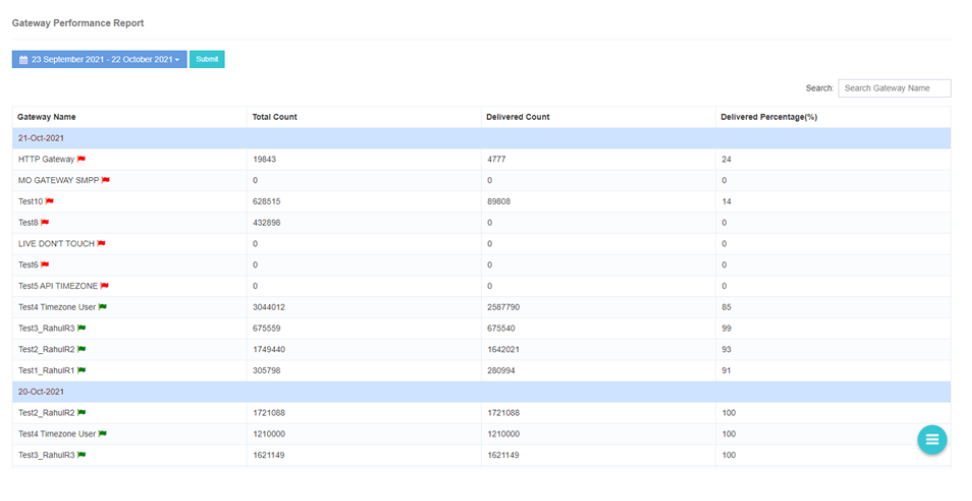

# Gateway Status Report

iTextPRO offers a **comprehensive Gateway Status Report**, allowing users to quickly **assess and compare** the performance of various vendor gateways.

## Performance Categories

### Best Performing
- **Delivery Percentage:** Over **80%**
- Indicates **exceptional delivery performance**.

### Good Performing
- **Delivery Percentage:** Over **60%**
- Represents **commendable delivery performance**.

### Average Performing
- **Delivery Percentage:** Over **40%**
- Reflects **moderate delivery performance**.

---

## Accessing the Gateway Status Report

1. Enter the **vendor gateway name** in the search box.  
2. Select the desired **date range**.  
3. Submit the search to generate a **detailed performance report** for the selected gateway.  

---

## Important Notes
- The **message status-wise count** in the report is displayed according to the **user's time zone**.

---

The **Gateway Status Report** empowers administrators to:
- **Compare** vendor gateway performance.
- **Identify** top-performing gateways.
- **Optimize SMS delivery strategies** based on accurate performance metrics.
