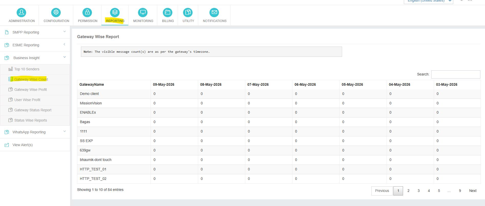
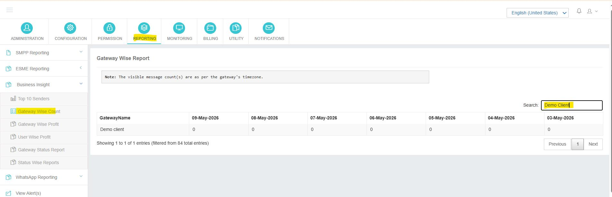

---
tags:
  - Reporting
  - Business Insight
  - Gateway
---

# Gateway Wise Count

**Navigation:**   .

## Genel Bakış Genel Bakış Genel Bakış Genel Bakış Genel Bakış Genel Bakış Genel Bakış Genel Bakış Genel Bakış Genel Bakış Genel Bakış

The The The The The The The The **Gateway Wise Count** Rapor, yöneticilere tüm yapılandırılmış ağ geçidindeki mesaj teslim hacimlerinin konsolide edilmiş bir görünümü sağlar. Rapor, raporu kapsar **Son yedi gün** Günlük olarak, trafik modellerini tanımlamak ve bir bakışta dağıtım kurmak kolay hale getirmek.

---

## Gateway Filtresi Kullanımı

Raporu belirli bir ağ geçidine daraltmak için, istenen ağ geçidini istenen ağ geçidinden seçin **dropdown filtre** Rapor ekranında mevcut. Masa sadece o ağ geçidin teslim verilerini göstermek için yenilenecektir.

---

## Rapor Ne Gösteriyor

| Köşe | Açıklama |
|--------|-------------|
| **Gateway Name Name** | yapılandırılmış ağ geçidinin dost adı. |
| **Tarih sütunları (günde bir tane)** | Total message count rotad through that Gateway on the corresponding day. |

!!! note
 Görünen mesaj sayıları her birine karşı hesaplanır **Gateway'in kendi zaman bölgesi**Ancak uygulama zamanı bölgesi değil. Bu masanın üzerindeki sayfa notunda gösterilmiştir.

---

## Bu Raporu Ne Zaman Kullanılır

- Satıcı veya ağ sorunlarını gösteren günlük trafik dipleri.
- Emekliliğe veya yeniden yönlendirmeye aday olabilecek en az kullanılan ağ geçitlerini tanımlayın.
- Yeni ek ağ geçitlerinin trafik beklenen payı aldığını onaylayın.
- Paydaşlar için hızlı hafta içi hacim anlık görüntüler sağlayın.
