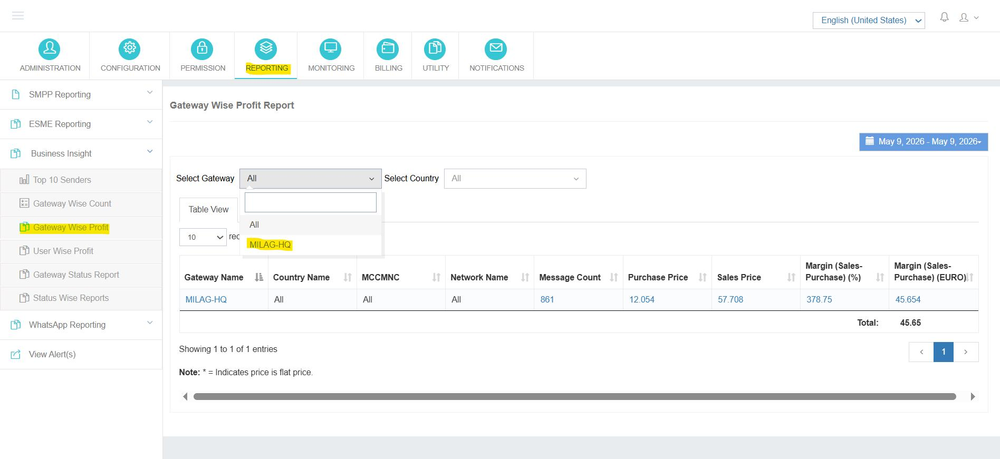
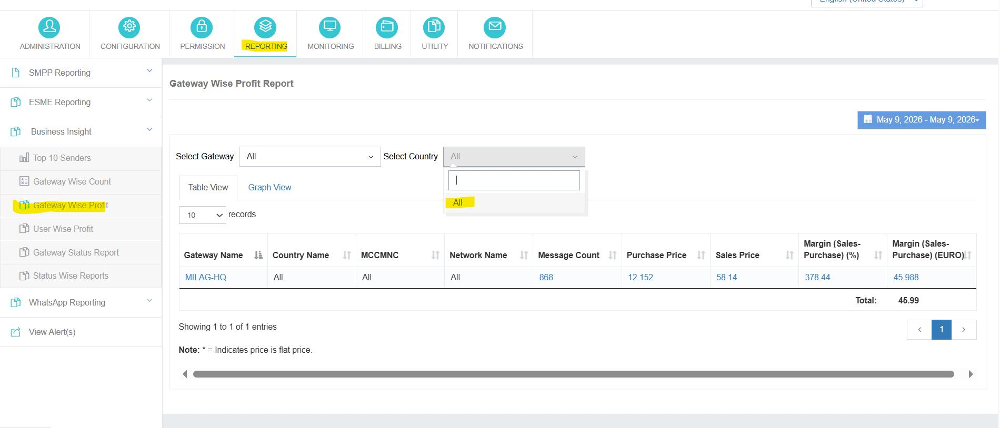
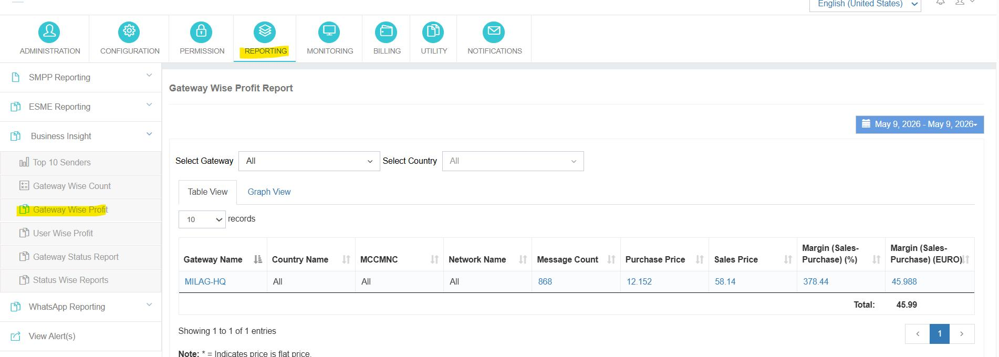
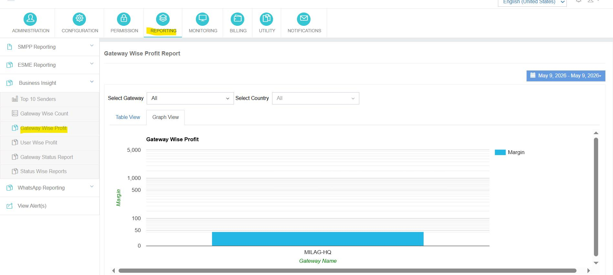

---
tags:
  - Reporting
  - Business Insight
  - Gateway
  - Profit
---

# Relatório de Lucro Sábio de Gateway

**Navegação:** <span data-ph="0"></span> □ <span data-ph="1"></span> □ <span data-ph="2"></span>.

## Visão geral

A **Relatório de Lucro Sábio de Gateway** fornece aos administradores uma desagregação detalhada da rentabilidade de nível de gateway e análise de tráfego de SMS. Ele é projetado para apoiar análise financeira, verificação de faturamento e monitoramento de desempenho de gateway, apresentando **custo de compra**, **valor de venda**, e **margens de lucro** para o tráfego SMS encaminhado através de cada gateway.

---

## 1. Seleção do Gateway

Selecione um gateway específico do dropdown para gerar um relatório de lucro escopo para o tráfego desse gateway.



---

## 2. Seleção de País

O relatório pode ser ainda filtrado pelo país de destino, permitindo uma análise de rentabilidade granular a nível nacional.



---

## 3. Filtro de Intervalo de Datas

Os administradores podem definir um **intervalo de datas personalizado** Gerar relatórios de lucro para qualquer período histórico.

!!! info "Características do intervalo de datas"
    - Análise diária e histórica do tráfego
    - Filtragem flexível baseada em datas
    - Apoio à verificação do período de facturação
    - Revisão do desempenho operacional em qualquer calendário

---

## 4. Tabela Ver Relatório

A **Vista da Tabela** Apresenta dados de lucro de gateway no país em formato tabular estruturado com as seguintes colunas:

| Coluna | Designação das mercadorias |
|--------|-------------|
| **Nome do Portal** | O portal a encaminhar o tráfego. |
| **Nome do país** | País de destino do tráfego. |
| **MCCMNC** | Código do país móvel + Código da rede móvel. |
| **Nome da rede** | Rede móvel de destino. |
| **Contagem de Mensagens** | Total de mensagens SMS enviadas para esta fatia. |
| **Preço de Compra** | Custo de roteamento para esta fatia. |
| **Preço de venda** | Receitas obtidas com esta fatia. |
| **Margem (Vendas - Compra) %** | Percentagem de lucro calculada. |
| **Margem (Vendas - Compra) (EURO)** | Valor absoluto dos lucros em euros. |



!!! note
 <span data-ph="0"></span> contra um preço indica que o preço é um preço fixo.

---

## 5. Graph View Report

A **Vista de Gráficos** fornece uma representação visual bar-chart da rentabilidade do gateway, permitindo a identificação rápida de gateways de alto desempenho e baixo desempenho ou países de destino.



---

## 6. Fórmula de cálculo do lucro

O relatório utiliza as seguintes fórmulas-padrão para obter métricas de rentabilidade:

```
Margin (Base Currency) =  Sales Price − Purchase Price

Margin Percentage (%)  = ((Sales Price − Purchase Price) / Purchase Price) × 100
```

---

## Objetivo do relatório de lucro sábio Gateway

!!! info "Use este relatório para..."
    - Monitorar a rentabilidade do gateway em tempo real
    - Comparar as margens do país e do gateway
    - Acompanhe o volume de tráfego SMS e custos associados
    - Reveja receita gateway vs. custo de compra
    - Apoio à verificação de relatórios financeiros e facturação
    - Otimizar estratégias de encaminhamento para uma melhor gestão das receitas
    - Exportar relatórios para análise offline e manutenção de registos
