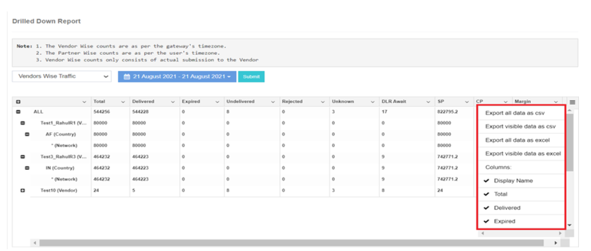
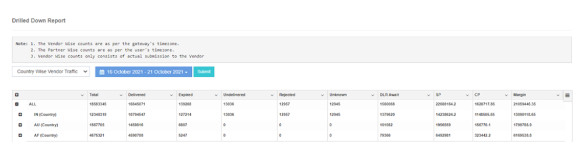
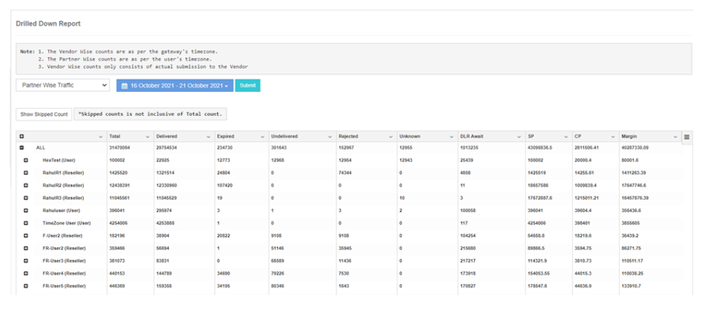
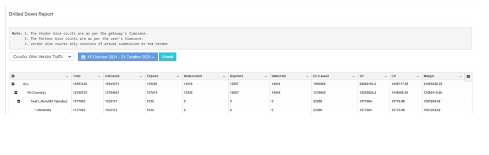
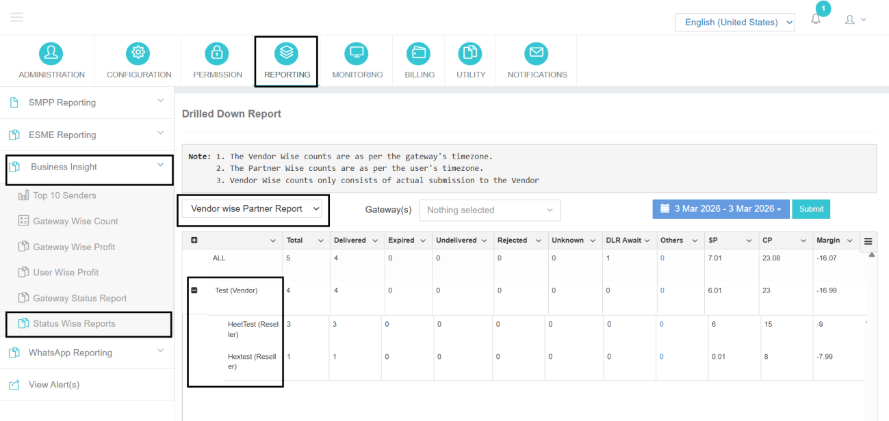
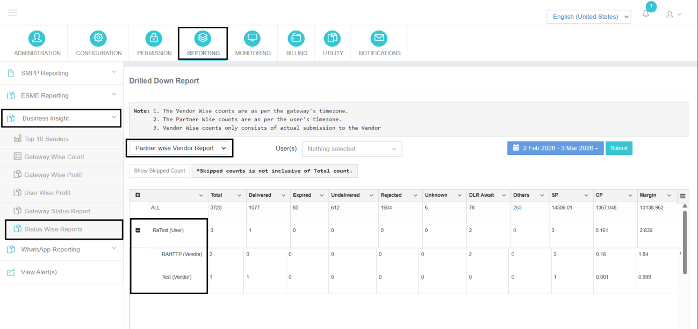

# Status Wise Report

iTextPRO offers a **robust reporting module**, enabling users to access **detailed vendor-wise and user-wise reports** — essential for accurate billing and performance analysis.

---

## 1. Vendor Wise Traffic
- Displays **vendor-wise traffic** based on the **time zone** of each vendor gateway.  
- Counts include actual messages submitted, **excluding DLR compensation SMS counts**.  
- Provides insights into **delivery status** and **performance per vendor gateway**.  
- **Key Metrics:**  
  - **SP** – Selling Price  
  - **CP** – Cost Price  
  - **Margin** – `SP - CP`

---

## 2. Country-wise Vendor Traffic
- Select a **date range** to view SMS counts submitted to each country.  
- **Drill-down option** reveals vendor gateway names and detailed SMS traffic information.  
- Enables deeper analysis of **SMS traffic patterns** within a **specific country and network**.

---

## 3. Partner Wise Traffic
- Displays **partner-wise traffic** based on the **time zone** of each user.  
- Shows **SMS traffic** and **delivery status** for each partner.  
- **Drill-down view** reveals countries and specific networks linked to a username.

---

## 4. Country Wise Partner Traffic
- Provides a **detailed report** on SMS counts submitted to each country by partners.  
- Categorized by **message status** for comprehensive analysis.  
- **Drill-down view** offers insights into **messaging activity** across different countries and networks.

---

## 5. Vendor Wise Partner Report

The **Vendor Wise Partner Report**, available under the *Status-wise Report* section, provides administrators with a consolidated view of gateway-level traffic and its associated user consumption.

This report is designed to help administrators understand how a specific gateway is being utilized across the platform.

### Purpose of the Report

The primary objective of this report is to:

- Display total traffic processed through a selected gateway
- Show the list of users routing traffic via that gateway
- Present total consumption for each user
- Provide visibility for billing and operational review

This allows the administrator to evaluate gateway performance and usage distribution from a single interface.

---

## 6. Partner Wise Vendor Report

The **Partner Wise Vendor Report**, also available under the *Status-wise Report* section, provides a user-centric view of traffic distribution across multiple gateways.

This report focuses on how a specific user's traffic is routed through different gateways.

### Purpose of the Report

This report allows administrators to:

- Review total usage of a selected user
- Analyze how traffic is distributed across assigned gateways
- Monitor submission counts across multiple routes
- Check status-wise delivery counts per gateway

It provides a complete picture of a user's routing behavior and consumption pattern.

---

## Additional Information
- All reports can be **downloaded in Excel** formats.  
- Users can **show or hide specific columns** for tailored analysis.  
- Reports provide **valuable data** for:
  - Billing  
  - Performance assessment  
  - Strategic decision-making  
- Flexible report configuration allows **customized views** for better usability.

---

These reporting tools help users **derive meaningful insights**, **optimize SMS delivery strategies**, and **streamline billing processes** in iTextPRO.
