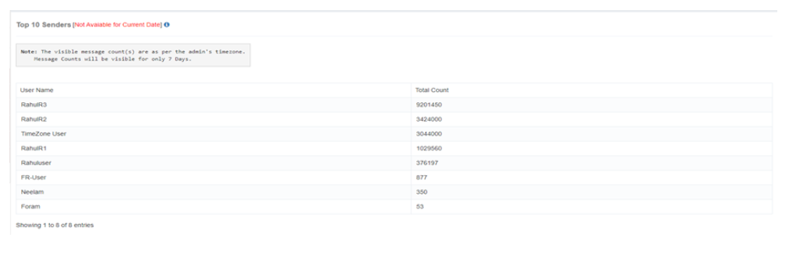

# Perspectives d'affaires

iTextPRO va au-delà de la collecte de données, **algorithme robuste de profilage des données** et **Moteur de profilage** à livrer **perspectives d'affaires réalisables**. Cela transforme les données brutes de trafic SMS en une intelligence significative pour **partenaires** et **passerelles fournisseurs**.

## Algorithme de profil des données
- Utilisation **algorithme de profilage puissant** pour capturer et analyser divers points de données de trafic SMS.

## Moteur de profilage
- Traitement des données saisies dans **une information structurée et significative**.

## Rapports détaillés
- Génération **Rapports de forage** avec un aperçu complet des tendances et des performances du trafic SMS.

## Autonomisation des utilisateurs
- Permet de prendre des décisions éclairées grâce à des idées claires et réalisables.
- Évite les utilisateurs accablants avec des données brutes — se concentrant plutôt sur **des renseignements prêts à prendre des décisions**.

## Pour les partenaires et fournisseurs
- Les perspectives sont **sur mesure** pour les partenaires et les fournisseurs.
- Chaque partie peut accéder aux rapports pertinents **optimiser leurs opérations**.

---

# Top 10 des expéditeurs

Les **Top 10 des expéditeurs** fonctionnalité aide à identifier le **utilisateurs les plus actifs** dans les campagnes SMS **7 jours**.

## Documents accessibles
- Affiche la **les 10 principaux utilisateurs** avec le plus grand engagement dans les campagnes SMS.

## Calendrier
- L'analyse est basée sur la **7 derniers jours** pour un instantané récent de l'activité.

## Reconnaissance d'utilisateur Premium
- Reconnaît **utilisateurs premium** qui courent régulièrement **campagnes SMS en grand volume**.

## Nombre de SMS
- Affiche la **volume des campagnes** exécuté par chaque utilisateur.
- Les comptes sont affichés selon le **compte admin**.

## Prise en compte du fuseau horaire
- Les chiffres affichés peuvent différer des chiffres en temps réel en raison des différences de fuseau horaire.
- L'accent est mis sur **tendances de l'engagement** au cours de la période considérée.

---

En combinant **Perspectives d'affaires** avec **Top 10 des expéditeurs** analyse, iTextPRO fournit aux administrateurs et aux partenaires les outils nécessaires pour **surveiller l'engagement, optimiser les opérations et identifier les utilisateurs de grande valeur**.
