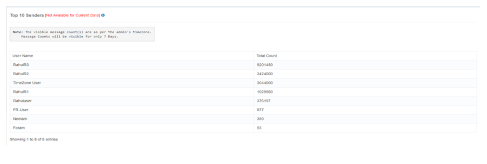

# Business Insights

iTextPRO goes beyond data collection, leveraging a **robust data profiling algorithm** and **profiling engine** to deliver **actionable business insights**. This transforms raw SMS traffic data into meaningful intelligence for **partners** and **vendor gateways**.

## Data Profiling Algorithm
- Utilizes a **powerful profiling algorithm** to capture and analyze diverse SMS traffic data points.

## Profiling Engine
- Processes the captured data into **structured, meaningful information**.

## Detailed Reports
- Generates **drill-down reports** with comprehensive insights into SMS traffic trends and performance.

## Empowering Users
- Enables informed decision-making through clear, actionable insights.
- Avoids overwhelming users with raw data — focusing instead on **decision-ready intelligence**.

## For Partners and Vendors
- Insights are **tailored** for both partners and vendor gateways.
- Each party can access relevant reports to **optimize their operations**.

---

# Top 10 Senders

The **Top 10 Senders** feature helps identify the **most active users** in SMS campaigns over the last **7 days**.

## Accessible Records
- Displays the **top 10 users** with the highest engagement in SMS campaigns.

## Time Frame
- Analysis is based on the **last 7 days** for a recent snapshot of activity.

## Premium User Recognition
- Recognizes **premium users** who consistently run **large-volume SMS campaigns**.

## SMS Counts
- Shows the **volume of campaigns** executed by each user.
- Counts are displayed according to the **admin account’s time zone**.

## Time Zone Consideration
- Displayed counts may differ from real-time numbers due to time zone differences.
- Focus is on **engagement trends** within the reporting period.

---

By combining **Business Insights** with the **Top 10 Senders** analysis, iTextPRO provides admins and partners with the tools needed to **monitor engagement, optimize operations, and identify high-value users**.
