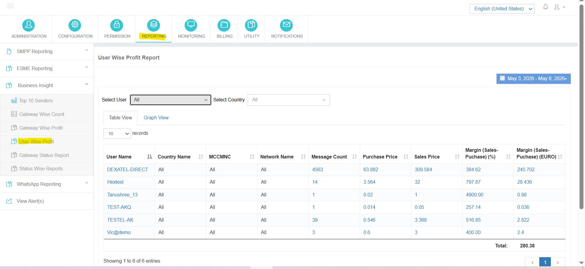
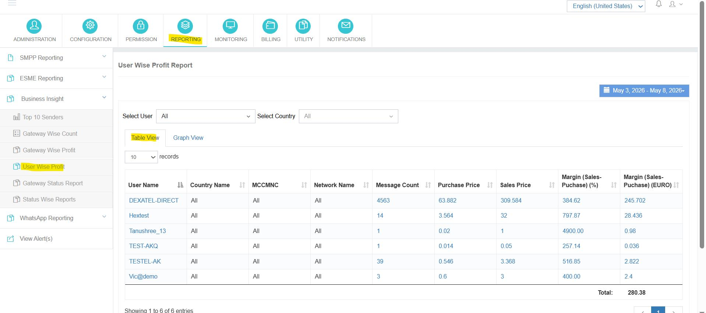
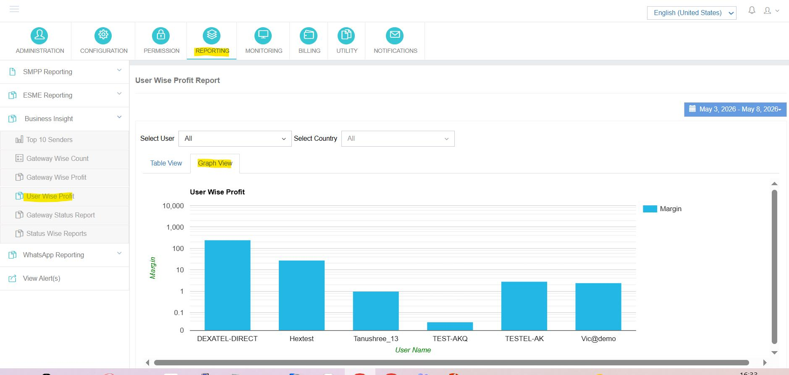

---
tags:
  - Reporting
  - Business Insight
  - User
  - Profit
---

# 使用者智慧利潤報告

**導航 :** <span data-ph="0"></span> ➔ <span data-ph="1"></span> ➔ <span data-ph="2"></span>。 。 。 。

## 概覽

這個 **使用者智慧利潤報告** 使管理員能夠分析任何選定日期範圍的使用者級簡訊流量和利潤率。 報告基於 **完全基於使用者透過應用程式提交的資訊** 並提供每個客戶賬戶的詳細收入、成本和差值資料。

---

## 1. 選擇使用者

從下拉列表中選擇一個特定的使用者賬戶來為該客戶生成目標利潤報告.

## 2. 國家選擇

按目的地國過濾流量資料,以獲得每個區域的使用者利潤率的顆粒分析。

## 3. 日期範圍過濾器

定義自定義的日期範圍,以生成任何計費或運營期間的使用者利潤報告.

---

## 4. 表檢視報告

這個 **表格檢視** 以表格格式顯示詳細的使用者盈利資訊。





### 引用欄

| 欄 | 說明 |
|--------|-------------|
| **使用者名稱** | 使用者賬戶的名稱/識別符號 。 |
| **國家名稱** | 使用者簡訊流量的目的地國. |
| **MCCMNC 中超聯賽** | 移動鄉村程式碼+行動網路程式碼. |
| **網路名稱** | 目標行動網路名稱. |
| **信件計數** | 使用者提交的短訊息總數. |
| **購買價格** | 辦理使用者流量實際發生的路由費用. |
| **銷售價格** | 向用戶收取的銷售總額。 |
| **邊際百分比(銷售-購買)** | 計算使用者流量的利潤百分比. |
| **邊際(銷售-購買)** | 從使用者流量中獲得的總利潤(美元)。 |

---

## 5. 圖景報告

這個 **圖表檢視** 製作一個條形圖,顯示使用者的盈利能力,從而能夠快速比較客戶。



---

## 6. 信件提交分析

使用者智慧利潤報告中的所有計算都驅動 **專職** 透過使用者端透過應用程式提交的資訊。 繞過應用程式使用者提交路徑的流量不包含在本報告中.

---

## 7. 利潤計算公式

```
Margin (USD)          =  Sales Price − Purchase Price

Margin Percentage (%) = ((Sales Price − Purchase Price) / Purchase Price) × 100
```

!!! tip
 將本報告與 **閘道器智慧利潤** 從兩個互補角度——客戶(收益方)和供應商(成本方)——看利潤率。
