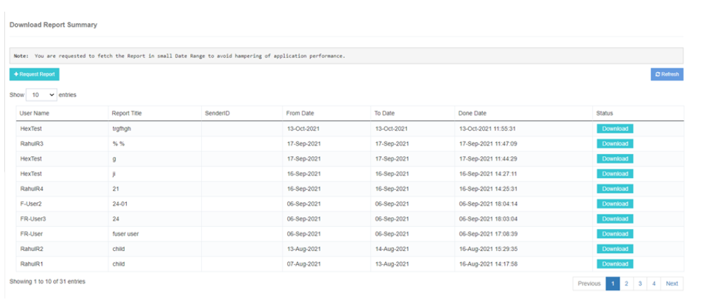
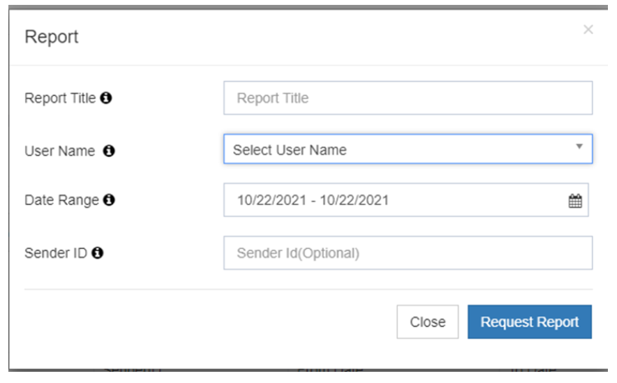
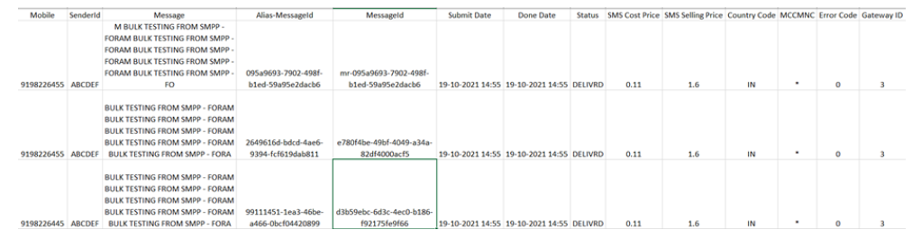

# Descargar Report

El **iTextPRO Descargar Report** función permite a los usuarios descargar fácilmente los informes SMS **Formato Excel** para un análisis detallado.

## Solicitud de descarga
1. Navigate a la **iTextPRO** plataforma.
2. Localizar el **"Descargar informe"** Opción.

## Iniciar la solicitud de descarga
- Haga clic en **"Request Report"** Opción.
- Una página emergente aparecerá para introducir detalles de descarga.

## Descargar Detalles
- **Report Title** – Proporcionar un nombre fácil de usar para el informe.
- **Nombre de usuario** – Especifique el nombre de usuario de la cuenta de usuario para el informe.
- **Fecha de rango** – Definir el período para el informe. *(Nota: Un rango de fecha más largo puede tardar más tiempo en procesar.)*
- **ID del remitente** *(Opcional)* – Incluya un ID específico del remitente si es necesario.

## Opciones de seguimiento
- Al enviar la solicitud, iTextPRO muestra una lista de solicitudes de descarga existentes junto con sus **Situación actual**.
- Los usuarios pueden supervisar el progreso de sus solicitudes de descarga.

## Descarga de informes completados
 
- Una vez que el estado del informe indica **finalización**, los usuarios pueden descargarlo haciendo clic en **Descargar botón**.

---

Con **iTextPRO's Download Report** función, los usuarios pueden **solicitud, seguimiento y descarga** informes de SMS específicos de usuario para un análisis completo.
