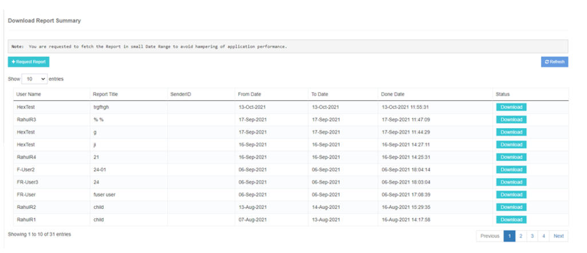
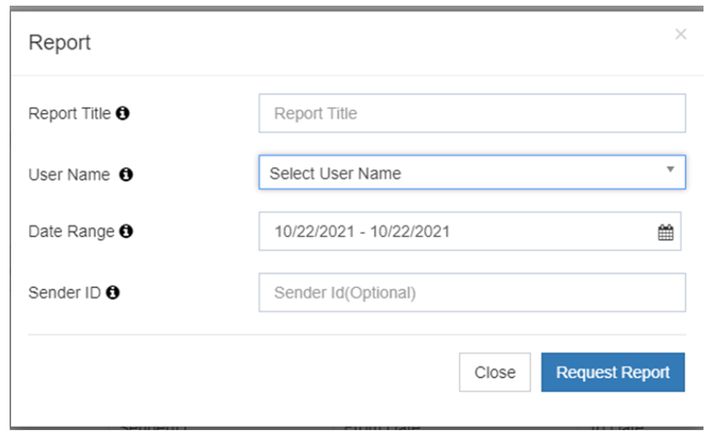
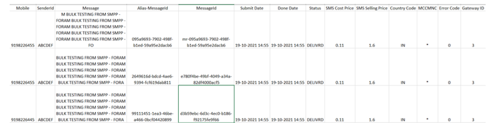

# Download Report

The **iTextPRO Download Report** feature allows users to easily download SMS reports in **Excel format** for detailed analysis.

## Accessing Download Request
1. Navigate to the **iTextPRO** platform.
2. Locate the **"Download Report"** option.

## Initiating Download Request
- Click on the **"Request Report"** option.
- A pop-up page will appear for entering download details.

## Entering Download Details
- **Report Title** – Provide a user-friendly name for the report.
- **Username** – Specify the username of the user account for the report.
- **Date Range** – Define the period for the report. *(Note: A longer date range may take more time to process.)*
- **Sender ID** *(Optional)* – Include a specific sender ID if needed.

## Tracking Download Requests
- Upon submitting the request, iTextPRO displays a list of existing download requests along with their **current status**.
- Users can monitor the progress of their download requests.

## Downloading Completed Reports
  
- Once the report status indicates **completion**, users can download it by clicking the **download button**.

---

With **iTextPRO's Download Report** feature, users can conveniently **request, track, and download** user-specific SMS reports for comprehensive analysis.
