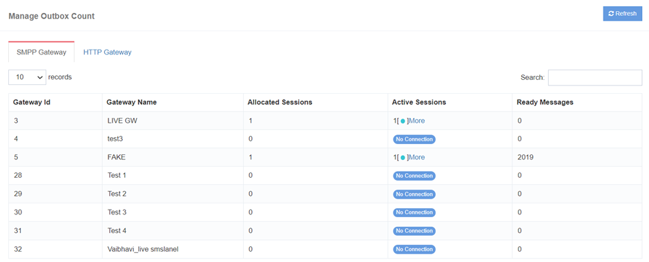
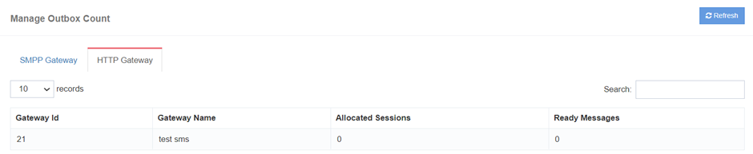

# Gateway Queue

  

In **iTextPRO**, efficient management of SMS traffic is a priority.  
Here's how the platform handles SMS traffic and provides essential insights:

## Traffic Accumulation and Queue Management
- iTextPRO collects SMS traffic from various user interfaces.
- The accumulated traffic is queued for submission to the vendor gateway.
- Users can check the **queue count** for each vendor gateway to gauge the volume of pending traffic.
- Queue information is **dynamic** and can be refreshed to display the most recent count.

## Visibility into Vendor Gateway Sessions
- Provides visibility into connected and active sessions of the vendor gateway.
- Users can monitor the status of **active connections** in real-time.
- No active connections in the sessions area may indicate a **network outage**, signaling potential connectivity issues.

## Dynamic Information Updates
- All information related to SMS traffic, queue counts, and gateway sessions is dynamic.
- Users can **refresh the data** to obtain the latest and most accurate information.
- Real-time updates ensure users have current insights into the status of SMS traffic and gateway connectivity.

## Network Outage Alert
- Absence of active connections in the sessions area can serve as an **alert for a network outage**.
- iTextPRO provides visibility into potential connectivity problems, allowing users to take timely actions.

---

iTextPRO's **SMS Traffic Management** features aim to provide users with **real-time information**, enabling effective monitoring and **proactive measures** for network-related issues.
