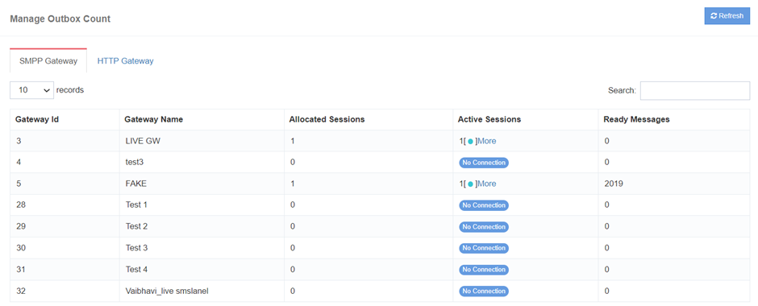
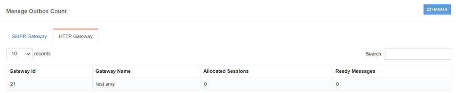

# Fila Gateway

 

In **iTextPRO**, a gestão eficiente do tráfego de SMS é uma prioridade. 
Veja como a plataforma lida com o tráfego SMS e fornece insights essenciais:

## Acumulação de tráfego e gerenciamento de filas
- iTextPRO coleta tráfego SMS de várias interfaces de usuário.
- O tráfego acumulado está em fila para submissão ao gateway do fornecedor.
- Os utilizadores podem verificar **número de filas** para cada gateway de fornecedores para medir o volume de tráfego pendente.
- Informação da fila é **dinâmico** e pode ser atualizado para exibir a contagem mais recente.

## Visibilidade nas Sessões do Portal do Fornecedor
- Fornece visibilidade em sessões conectadas e ativas do gateway do fornecedor.
- Os usuários podem monitorar o status de **ligações activas** em tempo real.
- Nenhuma ligação activa na área de sessões pode indicar **falha de rede**, sinalizando potenciais problemas de conectividade.

## Atualizações Dinâmicas de Informação
- Todas as informações relacionadas ao tráfego de SMS, contagem de filas e sessões de gateway são dinâmicas.
- Os utilizadores podem **atualizar os dados** obter as informações mais recentes e precisas.
- Atualizações em tempo real garantem que os usuários tenham informações atuais sobre o status do tráfego de SMS e conectividade de gateway.

## Alerta de perda de rede
- Ausência de ligações activas na área de sessões pode servir como **alerta para uma falha de rede**.
- O iTextPRO oferece visibilidade em potenciais problemas de conectividade, permitindo que os usuários tomem ações oportunas.

---

iTextPRO's **Gestão de Tráfego SMS** recursos visam fornecer aos usuários com **informação em tempo real**, permitindo um acompanhamento eficaz e **medidas pró-activas** para questões relacionadas com a rede.
