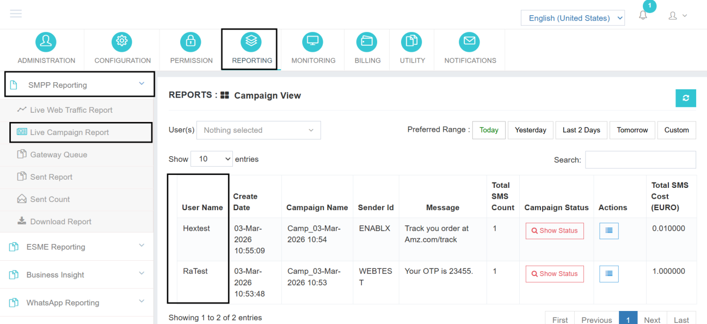
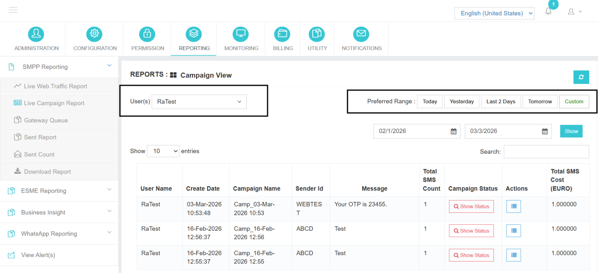
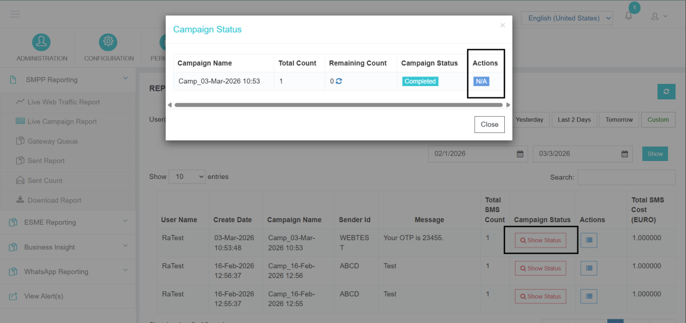
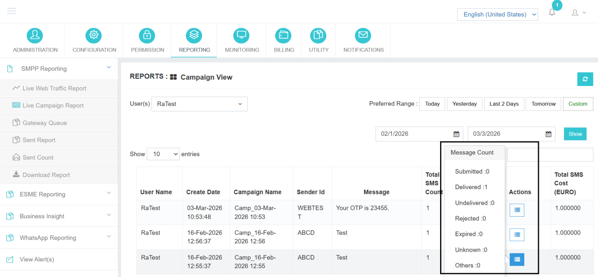

# Live Campaign Report

The **Live Campaign Report** module provides administrators with real-time visibility into all campaigns initiated across the platform.

While end users can view only their own campaigns from the User Panel, this section gives administrators a centralized view of campaigns created by **any user account** within the system.

This module is designed to help administrators:

- Monitor active and completed campaigns
- Track campaign processing status in real time
- Filter campaigns user-wise or date-wise
- Intervene and stop campaigns when required
- Analyze delivery status distribution

## Accessing the Live Campaign Report

To access the Live Campaign Report:

1. Log in to the Admin Panel.
2. Navigate to **Reports**.
3. Select **Live Campaign Report**.

Upon opening, the system will display a list of campaigns initiated within the default date range (typically Today).

---

## Filtering Options

The module provides flexible filtering options to help administrators quickly locate specific campaigns.

### A. Filter by User

Administrators can:

- Select a specific user account from the **User Filter**
- View only the campaigns initiated by that selected user

This is useful when:

- Investigating a support issue
- Monitoring high-volume senders
- Auditing campaign activity

### B. Date Range Selection

Campaigns can be filtered using the **Preferred Range** option:

- **Today** – Displays campaigns initiated on the current date
- **Yesterday** – Displays campaigns initiated on the previous date
- **Custom Range** – Allows selection of specific start and end dates

To use Custom Range:

1. Select "Custom"
2. Choose the desired start date
3. Choose the end date
4. Apply the filter

The system will fetch all campaigns initiated within the selected timeframe.

---

## Campaign Monitoring

If a large campaign is running under any user account, the administrator can monitor its processing in real time.

By clicking the **Show Status** button available in the interface:

- The administrator can view the current message processing details.

This feature is particularly useful for high-volume campaigns where close monitoring is required.

---

## Stopping a Campaign

If required, the administrator has the ability to stop an ongoing campaign.

The **Stop** button is available under the **Action** column in the interface.

!!! danger "Stop Campaign"
    - Click on the **Stop** button.
    - The campaign will be halted from further processing.
    - Messages already processed may not be affected, depending on their stage.

---

## Action Button – Status-Wise Count

The **Action** button also allows the vendor or administrator to check the detailed status-wise count for each campaign.

By using this option, the administrator can:

- View the count of messages under each delivery status.
- Analyze campaign performance.
- Identify any abnormal failure or pending patterns.

By clicking it, administrators can view a complete status-wise count of messages, including:

- **Submitted** Count
- **Delivered** Count
- **Undelivered** Count
- **Rejected** Count
- **Expired** Count (if applicable)
- **Unknown** Count
- **Others** Count

---

The **Live Campaign Report** provides administrators with complete oversight of all campaign activity, enabling real-time monitoring, user-specific filtering, and intervention capabilities for effective platform management.
