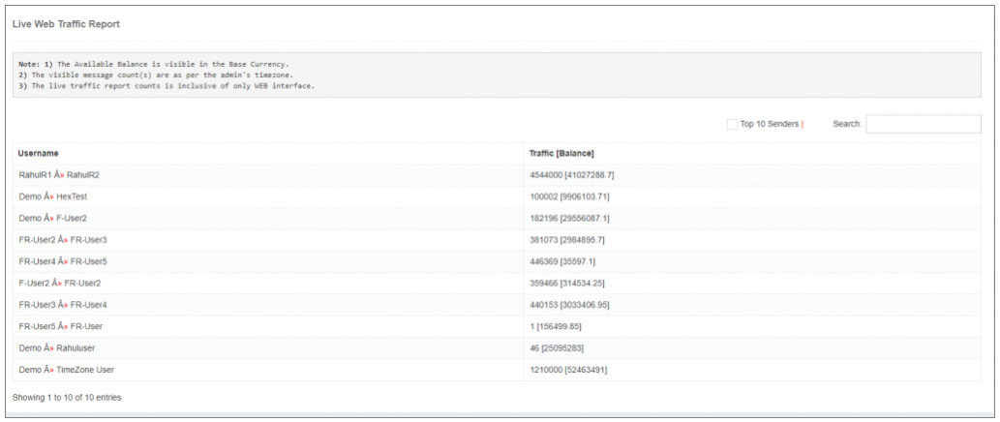

# Reporting

## iTextPRO Reporting Module Overview

The **iTextPRO Reporting Module** plays a crucial role in evaluating the precision and promptness of SMS traffic.  
Key features and functionalities include:

### Delivery Reports Engine
- Utilizes a sophisticated caching mechanism for **100% Delivery Receipt (DLR)** capture.
- Enables comprehensive status-wise reporting, providing in-depth information on message delivery.

### Synchronization with Routing Engine
- Invisible synchronization between the routing engine and the iTextPRO Delivery Report engine.
- Facilitates **adaptive routing** based on **Quality of Service (QoS)** for optimal performance and efficient message delivery.

### QoS-Driven Adaptive Routing
- Dynamic routing adjustments based on real-time Quality of Service metrics.
- Ensures maximum performance and effectiveness in delivering SMS messages.

### Accurate and Timely Assessment
- Enables administrators to assess the accuracy and timeliness of SMS traffic.
- Provides detailed insights into the performance of SMS messages through comprehensive reporting.

---

The integration of these features ensures that iTextPRO delivers not only reliable reporting capabilities but also aligns routing decisions with the Quality of Service metrics.  
This synergy contributes to enhanced performance, effective message delivery, and a deeper understanding of the SMS traffic landscape.

---

## Live Web Traffic Report

The **Live Web Traffic Report** in iTextPRO offers real-time insights into SMS traffic transmitted through the web interface.

### Key Features

#### Real-time SMS Traffic Monitoring
- Provides a live display of SMS traffic originating from the web interface.
- Allows users to monitor the flow of SMS messages in real-time.

#### Top 10 Senders
- Offers a list of the **Top 10 senders** based on traffic consumption.
- Enables users to identify and assess the most active contributors to SMS traffic.

#### Current Account Balances
- Displays the current account balance for each user in the **base currency**.
- Provides users with up-to-date information on their account balances.

#### Hierarchical Structures
- Presents the hierarchical structures of parent accounts linked to the user's account.
- Offers a clear visualization of the relationships between different accounts.

#### Comprehensive Information
- Ensures users have access to complete information about SMS traffic, sender activity, account balances, and account relationships.
- Facilitates a **holistic understanding** of the SMS traffic landscape.

---

The Live Web Traffic Report enhances user visibility into real-time SMS activities, sender behavior, and account dynamics.  
It is a valuable tool for **monitoring, analysis, and decision-making** within the iTextPRO platform.
