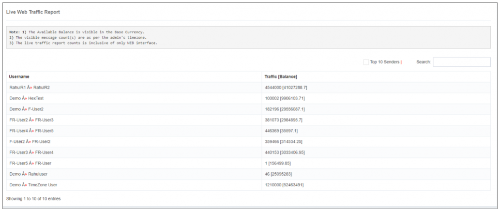

---
tags:
  - Reporting
  - DLR
  - Monitoring
---

# Raporlama

## iTextPRO Raporlama Modül Genel Bakış

The The The The The The The The **iTextPRO Reporting Module** SMS trafiğinin hassas ve hızlılığını değerlendirmek için önemli bir rol oynar. 
Anahtar özellikler ve işlevleri içerir:

### Teslimat Raporları
- Utilizes a sofistike caching mekanizması için **100% Delivery Receipt (DLR)** yakalama.
- Kapsamlı durum-bilinçli raporlama, mesaj teslimatı hakkında ayrıntılı bilgi sağlar.

### Routing Engine ile senkronizasyon
- Routing motoru ve iTextPRO Delivery Rapor motoru arasında görünmez senkronizasyon.
- Faciliteates **Adaptif routing** temelli olarak **Hizmet Kalitesi (QoS)** optimal performans ve verimli mesaj teslimat için.

### QoS-Driven Adaptive Routing
- Gerçek zamanlı Hizmet metriklerine dayanan dinamik yönlendirme düzenlemeleri.
- SMS mesajlarını teslim etmek için maksimum performans ve etkinliği sağlayın.

### Doğru ve Zamanlı Değerlendirme
- Enables yöneticileri, SMS trafiğinin doğruluğunu ve zamanlarını değerlendirmek için.
- Kapsamlı raporlama yoluyla SMS mesajlarının performansına ayrıntılı öngörüler sağlar.

---

Bu özelliklerin entegrasyonu, iTextPRO'in yalnızca güvenilir raporlama yetenekleri vermediğini sağlar, aynı zamanda Hizmet metrikleri ile yapılan kararları da birleştirir. 
Bu sinerji, performans, etkili mesaj teslimine katkıda bulunur ve SMS trafiğini daha derin bir anlayışa sahiptir.

---

## Canlı Web Trafik Raporu

The The The The The The The The **Canlı Web Trafik Raporu** iTextPRO web arayüzü aracılığıyla aktarılan SMS trafiğine gerçek zamanlı öngörüler sunar.

### Anahtar Özellikler

#### Gerçek zamanlı SMS Trafik İzleme
- Web arayüzünden kaynaklanan canlı bir SMS trafiği ekranını sağlayın.
- Kullanıcıların gerçek zamanlı olarak SMS mesajları akışını izlemelerine izin verin.

#### Top 10 Senders
- Bir listesini sunar **Top 10 gönderici** Trafik tüketimine göre.
- Kullanıcıların en aktif katkılarını SMS trafiğine tanımlamak ve değerlendirmek.

#### Mevcut Hesap Dengeleri
- Mevcut hesap bakiyesini her kullanıcı için ekranlar **Temel para birimi**.
- Kullanıcıların hesap dengeleri üzerinde güncel bilgiler sağlar.

#### Hierarchical Structures
- Kullanıcı hesabı ile bağlantılı ebeveyn hesaplarının hiyerarşik yapıları.
- Farklı hesaplar arasındaki ilişkilerin net bir görselleştirmesini sunar.

#### Kapsamlı Bilgiler
- Kullanıcıların SMS trafiği, gönderileyici aktivite, hesap dengesi ve hesap ilişkileri hakkında tam bilgilere erişimi vardır.
- Faciliteates a **Bütünsel anlayış** SMS trafik peyzajı.

---

Canlı Web Trafik Raporu, kullanıcı görünürlüğünü gerçek zamanlı SMS faaliyetlerine, gönderileyici davranışlara ve hesap dinamiklerine geliştirir. 
Bu değerli bir araçtır çünkü **İzleme, analiz ve karar verme** iTextPRO platformu içinde.
