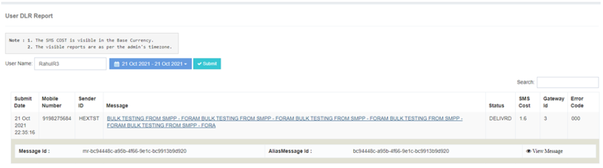
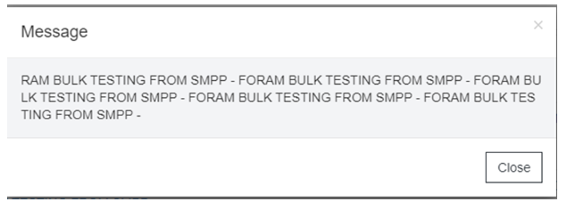

# User Sent Report

  

The **iTextPRO Sent Reports** feature provides detailed insights into successfully submitted SMS traffic, including delivery status and relevant details.

## User-Focused Search
- Users can input a specific **login** into the search box to access delivery records for a particular user.
- Choose the desired **date period** to narrow down the search and retrieve relevant information.

## Key Delivery Record Details
- **Date of Submission** – Indicates when the user sent the message to iTextPRO.
- **Mobile Number** – Destination address for the targeted campaign.
- **Sender ID** – Originator Address or Source Address used for the campaign.
- **Message** – Body of the message sent by the user.
- **Status** – Delivery report received by the vendor gateway.
- **SMS Cost** – SMS cost price for the user, visible in the base currency.
- **Gateway ID** – Identifies the vendor gateway to which the message is routed based on configured routing.
- **Error Code** – Error code received by the vendor gateway.

## Quick Access and Recommendations
- For quicker results, selecting a **shorter date range** is recommended.

## Detailed Message Information
Clicking on the message content reveals additional details, including:
- **Message-ID** – Provided by the Gateway Provider/Vendor upon acknowledgment.  
  In DLR compensation, the message-id includes the prefix **MR**.
- **Alias Message-ID** – System-generated message-id.

## View Message Link
- Users can click the **"View Message"** link to display the message content in the actual format sent by the user.

---

The **iTextPRO Sent Reports** feature empowers users with comprehensive insights into SMS traffic, enabling them to **track deliveries, troubleshoot issues, and review message details** effortlessly.
