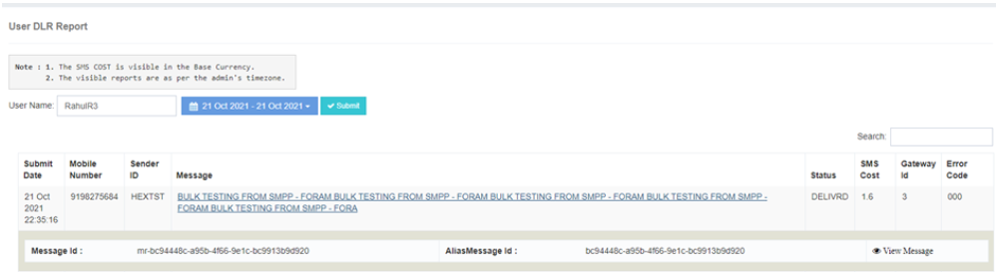
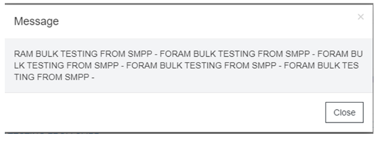

# User Sent Report

 

The The The The The The The The **iTextPRO Sent Raporlar** özellik, teslimat durumu ve ilgili ayrıntıları da dahil olmak üzere başarıyla SMS trafiğine ayrıntılı bilgiler sunar.

## User-Focused Search
- Kullanıcılar belirli bir giriş yapabilir **login login login** Belirli bir kullanıcı için teslimat kayıtlarına erişmek için arama kutusu içine.
- İstenileni seçin **tarih süresi** Aramayı daraltmak ve ilgili bilgileri almak.

## Anahtar Teslimat Kayıt Detayları
- **Submission** - Kullanıcı mesajı iTextPRO'e gönderdiğinde.
- **Mobile Number** - Hedeflenen kampanya için hedef adresi.
- **Sender ID** - Originator Adres veya Kaynak Adresi kampanya için kullanılır.
- **Mesaj** - Kullanıcı tarafından gönderilen mesajın Bedeni.
- **Durum durumu** - Satıcı ağ geçidi tarafından alınan teslimat raporu.
- **SMS Maliyeti** - Kullanıcı için SMS maliyeti, temel para biriminde görünür.
- **Gateway ID** - Mesajın yapılandırılmış routing'e dayandığı satıcı ağ geçidini belirtir.
- **Hata Kodu** - satıcı ağ geçidi tarafından alınan hata kodu.

## Hızlı Erişim ve Öneriler
- Daha hızlı sonuçlar için, bir seçin **Daha kısa tarih aralığı** önerilir.

## Detaylı Mesaj Bilgileri
Mesaj içeriğine tıklayın da dahil olmak üzere ek ayrıntıları ortaya çıkarır:
- **Mesaj-ID** - Gateway Sağlayıcısı/Vendor tarafından acknowledgment ile sağlayın. 
 DLR tazminatında, mesaj-id ön eki içerir **MR**.
- **Alias Mesaj-ID** - Sistem tarafından üretilen mesaj-id.

## View Message Link Link
- Kullanıcılar tıklayabilir **"View Message"** Kullanıcı tarafından gönderilen gerçek formattaki mesajı görüntülemek için bağlantı.

---

The The The The The The The The **iTextPRO Sent Raporlar** Özellikler, kullanıcıları SMS trafiğine kapsamlı bir anlayışla güçlendiriyor, onlara onları SMS trafiğine izin veriyor **Teslimatlar, sorun sorunları takip edin ve mesaj ayrıntıları** Zorsuzca.
