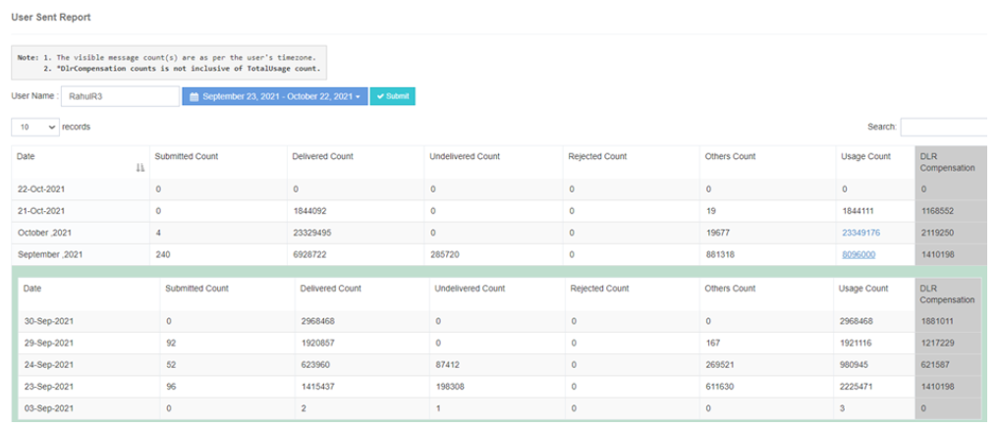

# Nombres d'envois d'utilisateurs

Les **Numéro d'envoi iTextPRO** fonction fournit un compte de statut de message pour un seul utilisateur, permettant un suivi complet des performances SMS.

## Recherche spécifique à l'utilisateur
- Introduire la valeur souhaitée **Nom d'utilisateur** dans la boîte de recherche.
- Sélectionnez le nécessaire **date** pour accéder au rapport de comptage par statut du message de l'utilisateur.

## Note sur la rémunération des DLR
- Les **Consommation totale** l'affichage fait **pas** inclure le compte d'indemnisation DLR.

## Affichage mensuel sommaire
- Choisir une **mois** affichera le nombre total de SMS par défaut.
- A **Lien hypertexte** est fourni, ce qui permet aux utilisateurs de forer plus en détail **statistiques résumées par date** pour ce mois-là.

## Prise en compte du fuseau horaire
- Le compte de statut du message affiché est basé sur le **fuseau horaire de l'utilisateur**.

---

Avec **Compte d'envoi de iTextPRO** fonctionnalité, les utilisateurs peuvent facilement **suivi de l'état du message**, évaluer le rendement et explorer des statistiques détaillées pour mieux comprendre le trafic SMS.
