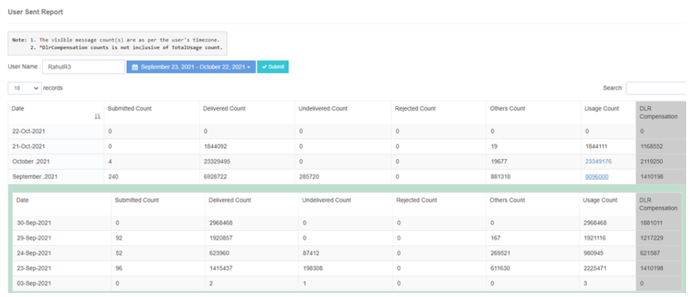

# User Sent Counts

The **iTextPRO Sent Count** feature provides a message status-wise count for a single user, enabling comprehensive tracking of SMS performance.

## User-Specific Search
- Input the desired **username** into the search box.
- Select the required **date range** to access the user's message status-wise count report.

## DLR Compensation Note
- The **total consumption count** displayed does **not** include the DLR compensation count.

## Monthly Summary Display
- Choosing a **month** will display the total SMS count by default.
- A **hyperlink** is provided, allowing users to drill down into more detailed **date-wise summary statistics** for that month.

## Time Zone Consideration
- The message status-wise count displayed is based on the **user's time zone**.

---

With **iTextPRO's Sent Count** feature, users can easily **monitor message status**, assess performance, and explore detailed statistics for a deeper understanding of SMS traffic.
