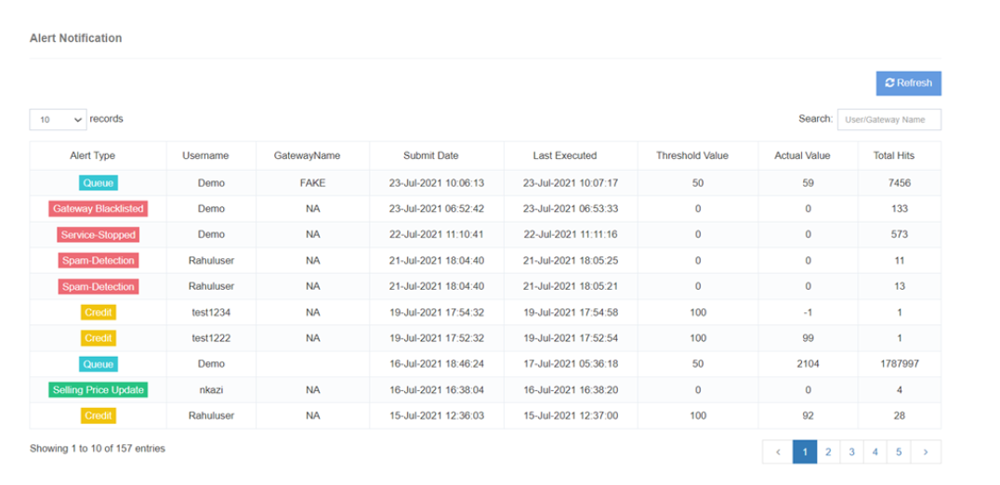

# View Alerts

The **View Alerts** feature in iTextPRO provides a comprehensive list of alerts issued to both **users** and **administrators**, offering real-time insights into important system events. Each alert is accompanied by a **detailed description** in the notification module, ensuring users stay informed and take appropriate actions.

---

## Key Features

### 1. Alert List
- Displays all alerts issued to **administrators** and **users**.  
- Covers a wide range of **notification events** for better situational awareness.

### 2. Thorough Descriptions
- Each alert includes a **detailed description** explaining its nature and context.  
- Descriptions help users understand the **reason** behind the alert.

### 3. Event Notification
- Alerts are triggered in response to various **events** within the iTextPRO system.  
- Users can review the list to remain informed about **critical occurrences**.

### 4. Actionable Insights
- Alerts provide **clear guidance** on potential follow-up actions.  
- Designed to help users quickly respond to important situations.

---

## User Benefits

- **Enhanced Awareness** – Stay informed about critical system activities.  
- **Proactive Response** – Detailed descriptions enable prompt, effective action.  
- **Efficient Issue Resolution** – Facilitates faster problem-solving.  
- **Improved Communication** – Ensures important events are effectively communicated.

---

The **View Alerts** feature ensures a **proactive and informed user experience**, enabling timely responses and efficient management of events within the iTextPRO system.
