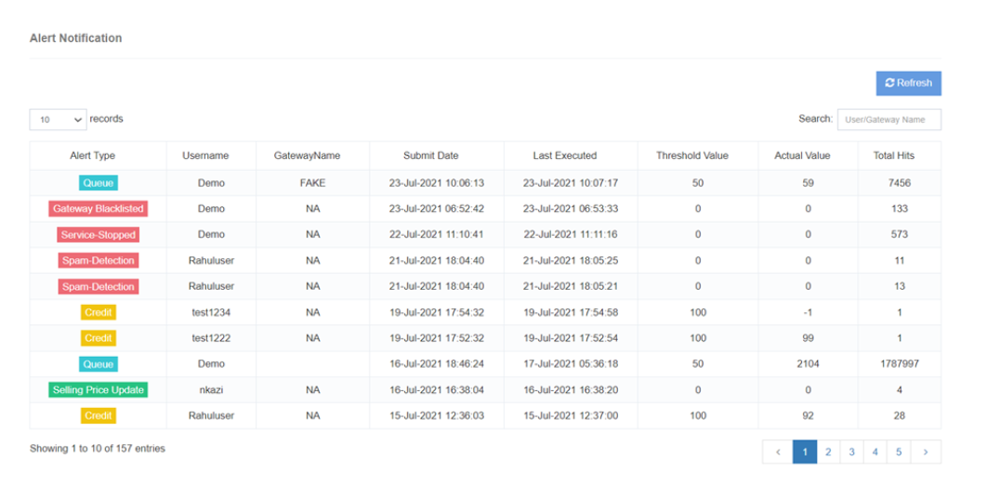

# View Alerts

The The The The The The The The **View Alerts** iTextPRO'de her ikisine de yayınlanan kapsamlı bir uyarı listesi sunar. **Kullanıcılar** ve **Yöneticiler**Gerçek zamanlı öngörüleri önemli sistem etkinliklerine sunmak. Her uyarı bir araya geliyor **ayrıntılı açıklama** Bildirim modülünde, kullanıcıların bilgilendirilmesi ve uygun eylemler almasını sağlayın.

---

## Anahtar Özellikler

### 1. Uyarı Listesi
- Ekranlar tüm uyarılar yayınlandı **Yöneticiler** ve **Kullanıcılar**. 
- Kapaklar geniş bir aralığı **Bildirim olayları** Daha iyi durum farkındalığı için.

### 2. Thorough Açıklamalar
- Her uyarı bir uyarı içerir **ayrıntılı açıklama** Doğasını ve bağlamını açıklayın. 
- Açıklamalar kullanıcıların anlamalarına yardımcı olur **Sebep nedeni** Uyarının arkasında.

### 3. Event Bildirim
- Uyarılar çeşitli yanıtlara yanıt olarak tetiklenir **olaylar olayları** iTextPRO sistemi içinde. 
- Kullanıcılar listeyi gözden geçirebilmek için listeyi inceleyebilir **kritik olaylar**.

### 4. Actionable Insights
- Uyarılar sağlar **net rehberlik** Potansiyel takip eylemleri üzerinde. 
- Kullanıcıların önemli durumlarda hızlıca yanıt vermesine yardımcı olmak için tasarlanmıştır.

---

## Kullanıcı Faydaları

- **Geliştirilmiş Farkındalık** - Kritik sistem faaliyetleri hakkında bilgi edinin. 
- **Proaktif Yanıt** - Detaylı açıklamalar hızlı, etkili bir eylem sağlar. 
- **Verimli Sorun Çözümü** - Faciliteates daha hızlı problem çözme. 
- **Geliştirilmiş İletişim** - Önemli olayların etkili bir şekilde iletişim kurması sağlanır.

---

The The The The The The The The **View Alerts** özellik bir kolaylık sağlar **proaktif ve bilgili kullanıcı deneyimi**Ancak, iTextPRO sistemi içindeki olayların zamanında cevaplarını ve verimli yönetimini sağlar.
