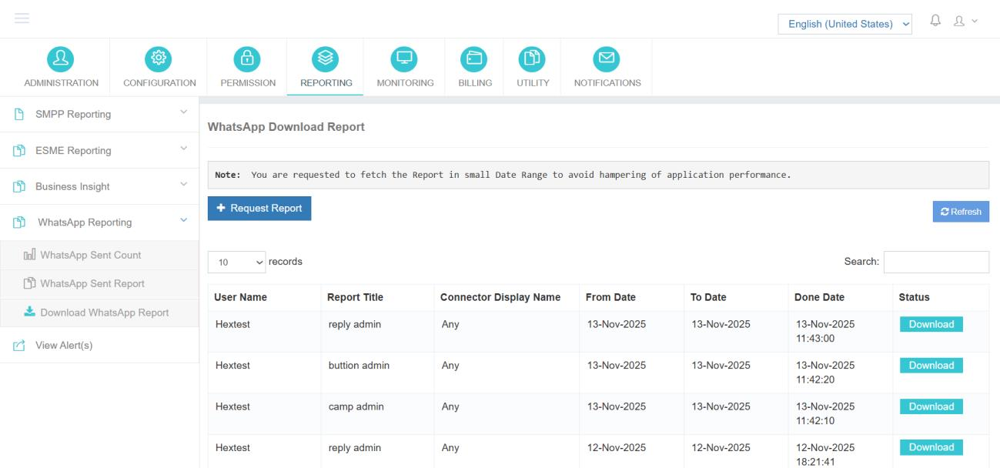
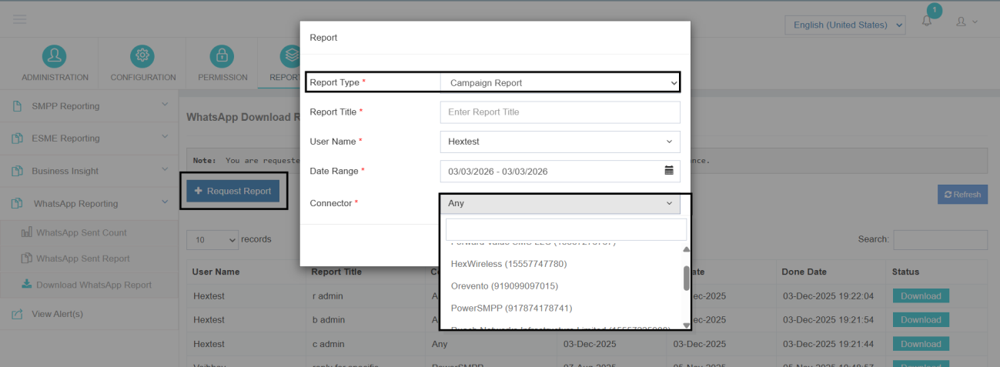

---
---

# Download WhatsApp Report

The **Download WhatsApp Report** feature enables administrators to generate and download detailed WhatsApp campaign reports in file format.

This functionality helps in:

- Performance analysis
- Internal reporting
- Billing reconciliation
- Sharing structured data with clients

It also ensures that WhatsApp and SMS campaign records are maintained separately for better clarity and organization.

---

## Type of WhatsApp Report

To generate a downloadable report, the administrator must use the **Request Report** option.

When requesting a report, the admin/user can select from the following report types:

### 1. Campaign Report

The Campaign Report includes details of campaigns initiated from the application.

This report contains information such as:

- Mobile number
- Connector details
- Message content
- Message ID
- Message status

This report is typically used for delivery tracking and reconciliation.

### 2. Button Report

If a campaign includes interactive buttons (such as Opt-Out or other action buttons), the Button Report captures recipient interactions.

This report includes:

- Recipient number
- Time of interaction
- Button clicked by the recipient

It helps administrators analyze user engagement and response behavior.

### 3. Reply Report

If recipients respond to a WhatsApp message, those replies can be downloaded using the Reply Report option.

This report captures:

- Recipient number
- Reply content
- Date and time of reply

It is useful for reviewing customer responses and maintaining communication records.

---

## Steps to Download a WhatsApp Report

Follow the steps below to generate and download the required report:

**Step 1:** Click on **Request Report**
**Step 2:** Select the desired **Report Type**
**Step 3:** Enter a friendly name for the report
**Step 4:** Select the username for which the report is being requested
**Step 5:** Enter the date range for fetching the report
**Step 6:** Select the connector
**Step 7:** Click on **Request Report** to submit

### After Requesting

Once requested:

- The system will generate the file in the background.
- The report entry will be visible in the UI.
- Wait for processing to complete and refresh the page if required.
- When the status changes to **Download**, the file will be available.
- Click **Download** to save the report to your local system.

---

## Summary

The WhatsApp Reporting module provides both summary-level insights and detailed message-level analysis within a unified reporting framework.

With options such as Sent Count, Sent Report, and downloadable Campaign, Button, and Reply reports, administrators can effectively monitor performance, track interactions, and maintain structured communication records across WhatsApp campaigns.
