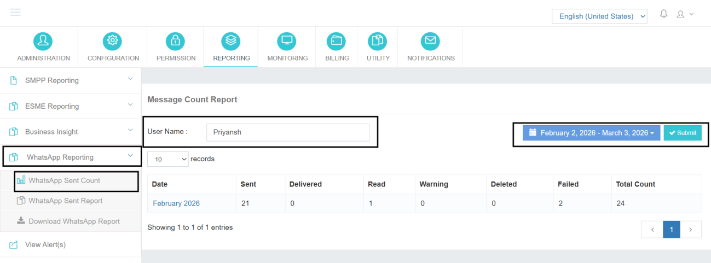

# WhatsApp Sent Count

The **WhatsApp Reporting** section has been integrated into the main Reporting module to provide administrators with centralized visibility across communication channels.

With this enhancement, the admin no longer needs to navigate to separate sections for different channels. Whether the report is related to SMS or WhatsApp, all reporting functionalities are accessible from the same Reporting module.

This unified structure ensures better monitoring, easier access to historical data, and simplified operational review.

---

## WhatsApp Sent Count

The **WhatsApp Sent Count** report provides a quick statistical summary of messaging activity.

This report allows the administrator to:

- Select a specific date range
- View the total number of WhatsApp messages sent within that period
- Filter data for a specific user, if required

By defining the desired date range, the system fetches and displays the total sent count for that duration. If a particular user is selected, the report will reflect only that user's message volume.

### Use Cases

This report is useful for:

- High-level usage review
- Monitoring daily or monthly traffic
- Quick consumption verification
- Basic billing reference

---

The **WhatsApp Sent Count** report offers a quick and efficient way to monitor WhatsApp messaging volumes across users and time periods.
