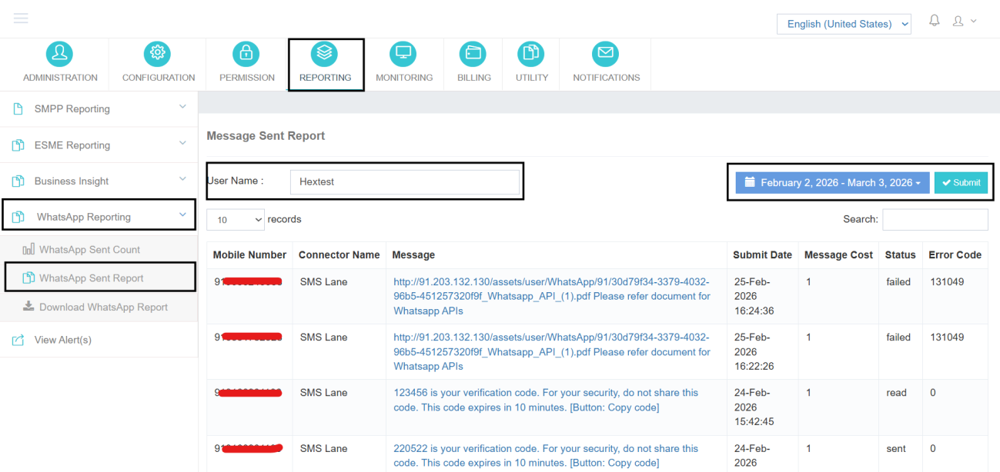

# WhatsApp Sent Report

The **WhatsApp Sent Report** provides detailed, message-level information for deeper analysis.

Unlike the Sent Count report, which shows aggregate numbers, this report displays individual message records.

## Record Details

Each record typically includes:

- **Mobile Number** – Recipient number
- **Connector Name** – Template used
- **Message** – Message content sent
- **Submit Date** – Submission date and time
- **Message Cost** – Cost per message
- **Status** – Current delivery status
- **Error Code** – Error codes (if applicable)

---

## Key Features

- Filter by **User Name** to view messages for a specific account
- Select a **date range** for targeted analysis
- Use the **Search** box for quick keyword filtering
- View delivery and failure details at the individual message level

---

The **WhatsApp Sent Report** serves as a comprehensive audit trail for WhatsApp message transactions, enabling administrators to track deliveries, troubleshoot failures, and review message details effortlessly.
